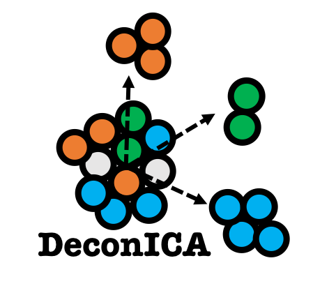

# DeconICA

**Github Status :** 

[](https://travis-ci.org/UrszulaCzerwinska/DeconICA)

## **Deconvolution of transcriptome through Immune Component Analysis**
<p align="center">

</p>

AN R PACKAGE FOR IDENTIFYING  IMMUNE-RELATED SIGNALS  IN TRANSCRIPTOME THROUGH DECONVOLUTION OR UNSUPERVISED  SOURCE SEPARATION METHODS


You can install `deconICA` from GitHub with:

```r
#install.packages("devtools")
devtools::install_github("UrszulaCzerwinska/DeconICA", build_vignettes = TRUE, dependencies = TRUE)
```

It should be available shortly on [CRAN](https://cran.r-project.org/web/packages/deconica/index.html)

---
check out the package website: [https://urszulaczerwinska.github.io/DeconICA/](https://urszulaczerwinska.github.io/DeconICA/)
### more information

*  for examples and tutorial: 
```r 
vignette(topic ="DeconICA_introduction", package="deconica")
```
   or at 
   + vignette 1 : [Introduction to deconICA](https://urszulaczerwinska.github.io/DeconICA/DeconICA_introduction.html) 
   + vignette 2 : [Running fastICA with icasso stabilisation](https://urszulaczerwinska.github.io/DeconICA/Icasso.html) 


* list of functions
```r 
help(package="deconica")
```
* [pdf manual](https://github.com/UrszulaCzerwinska/DeconICA/tree/master/inst/manual/DeconICA.pdf)
 

