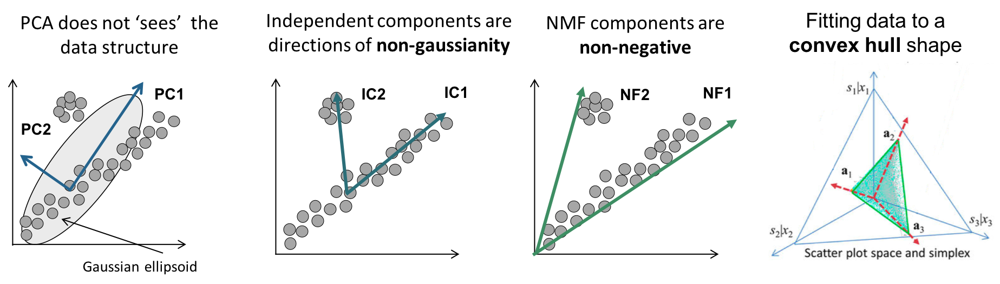
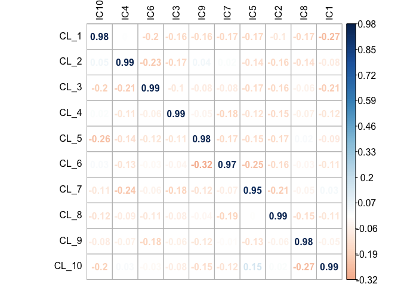
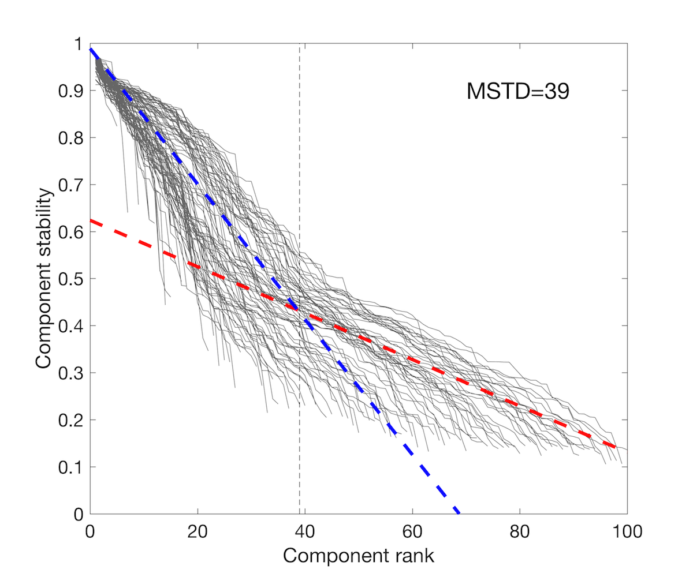
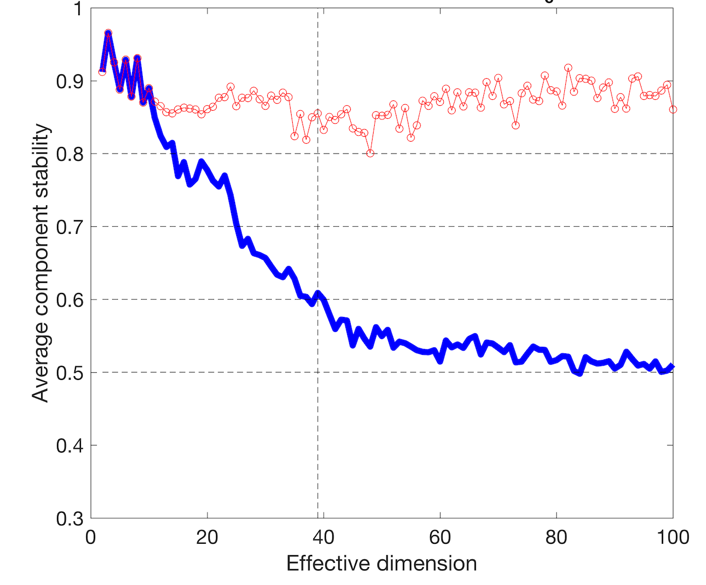
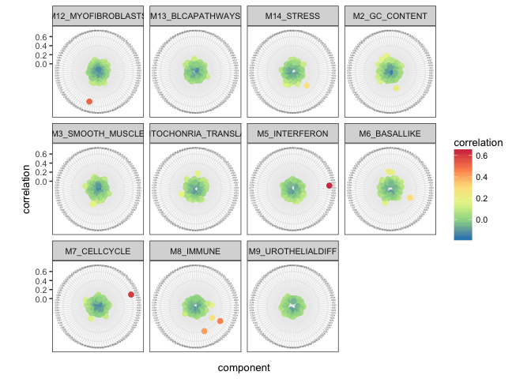
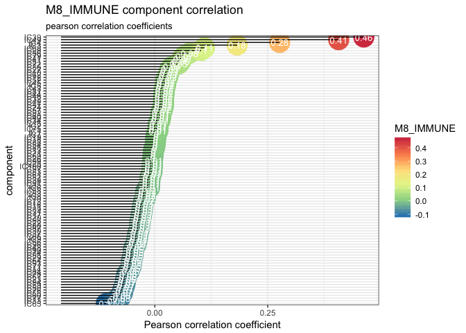
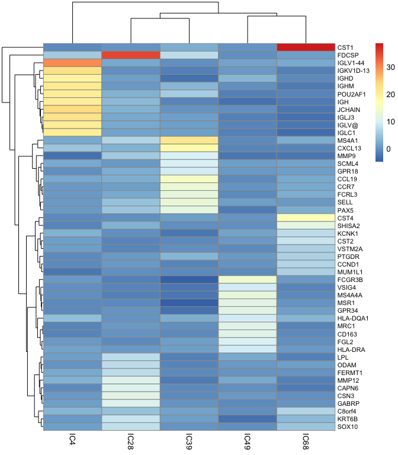
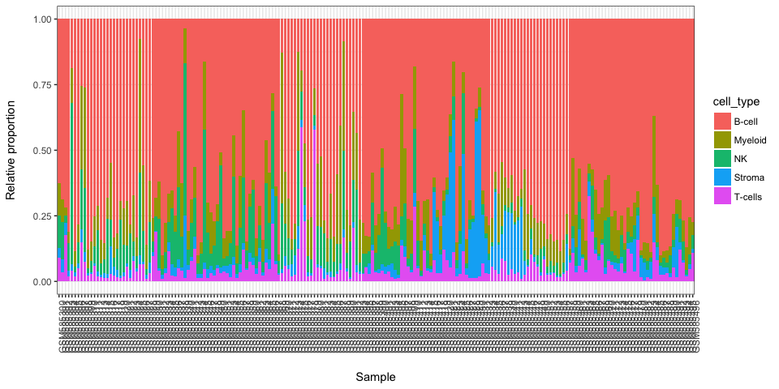

This is an introduction to the [`deconICA`](https://github.com/UrszulaCzerwinska/DeconICA) R package. 

**DeconICA** stands for **Deconvolution of transcriptome through Immune Component Analysis**. 

The aim of the project is to adapt blind source separation techniques to extract immune-related signals from mixed biological samples. A great exaple of mixed biological sample is transcriptome measured in heterogenous tissue such as blood or tumor biopsy. 

In this vignette we present short introduction to the blind source spearation techniques, the biological foundation of the problem and finally we walk you through examples on how to use [`deconICA`](https://github.com/UrszulaCzerwinska/DeconICA) R package.

If you are intrested only in practical examples of [`deconICA`](https://github.com/UrszulaCzerwinska/DeconICA), skip directly to [Tutorial](#Tut) section.

You can access this documentation on the [DeconICA website](https://urszulaczerwinska.github.io/DeconICA/).

# Background

## Blind source separation

Blind source separation (BSS) is the separation of a set of source signals from a set of mixed signals, without the aid of information (or with very little information) about the source signals or the mixing process. The separation is possible under a variety of conditions. 

A known example of BSS is a **cocktail party problem**, there is a group of people talking at the same time. You have multiple microphones picking up mixed signals, but you want to isolate the speech of a single person. BSS can be used to separate the individual sources by using mixed signals [@Hyvarinen2000]

## Application of BSS to biological data

Through decomposition of the transcriptome matrix into components (aka factors or sources) we hope to recover underlying biological functions and cell types. 

In tumor biopsies is it expected to find a part of Tumor Microenvironment (TME). TME includes tumor cells, fibroblasts, and a diversity of immune cells. Most studies have
focused on individual cell types in model tumor systems, and/or on individual molecules
mediating a crosstalk between two cells. Unraveling the complexity, organization, and mutual
interactions of TME cellular components represents a major challenge.

Several methods have been proposed to estimate the mixing proportions of sources in biological mixtures, such as: least squares regression [@Abbas2009] and more recently, non-negative least squares regression [Qiao2012], quadratic
programming [Gong2011] and supported vector
regression [@Newman2015]. Even though [@Vallania2017] shows that the used algorithm do not impact substantially the results. According to @Vallania2017, what matters are the gene signatures used as an input of overmentioned methods.

**BSS methods do not use pre-defined cell-type signatures**. The transcriptomic matrix is decomposed into a certain number of sources and then the sources are interpreted with available knowledge (gnee signatures, cell profiles).

The main argument of using BSS over supervised decomposition techniques is that the obtained result is **unbiased** by *a priori* biological hypothesis (however thre are alwyas statistical hypothesis about the nature of data) or knowledge. In addition BSS tachniques allow **discovery** of new biological signatures that can extend our available knowledge.

In the case of cell type separation from mix of tumor bulk, supervised techniques as CIBERSORT [@Newman2015], MCP counter [@Becht2016, @MCPcounter], TIMER [@Li2016] etc. are based on optimised blood signatues. With an evidence brought by single cell data, these signatures are not always characterising immune cells infiltrating tumors [@Schelker2017]. Some methods, like EPIC [@Racle2017], use single-cell based signatures. However, today, the single cell based signatures are limited to few cancer subtypes and often based on small number of patients, incoparable with the heterogeneity that is hidden in the bulk transcriptome cohort studies. 

Thefore, obtaining informative cell-type signature of immune cells infiltrating tumor biopsy samples at high thoughput remains an open question that we attept to approach with `deconICA` pipeline.

Here is a short overview of BSS or related algorithms that one can potentially use as an input to `deconICA`. At its actual state `deconICA` facilitates starting pipeline with ICA. 

<div class="figure" style="text-align: center">

<p class="caption">**Graphical representation of dimension reduction & BSS methods.** PCA, ICA, NMF inspired by figures of Andrei Zinovyev, Convex hull: CC BY [@Wang2016]</p>
</div>

### Independent Components Analysis

Independent Component Analysis (ICA) is a matrix factorization method for data dimension reduction [@Hyvarinen2000]. ICA defines a new coordinate system in the multi-dimensional space such that the distributions of the data point projections on the new axes become as mutually independent as possible. To achieve this, the standard approach is maximizing the non-gaussianity of the data point projection distributions [@Hyvarinen2000]. There is no contraint imposed on the non-negativity (in contrary to NMF) or orthogonality (in contrast to PCA). In our analysis, the negative projections are interpreted in terms of absolute values and only one side of a component is taken into account.

A mathematical way to formalize ICA is the set of equations:

the set of individual source signals $s(t) = (s_{1}(t), ...,  s_{n}(t))^T$ is mixed using a matrix $A = [a_{ij}] \in \mathbb{R}^{m \times n}$ to produce a set of mixed signals, $x(t) = (x_{1}(t), ...,  x_{m}(t))^T$, as follows:

 \[x(t) = A \times s(t)\]

The above equation is effectively 'inverted' as follows. Blind source separation separates the set
of mixed signals $x(t)$, through the determination of an 'unmixing' matrix  to $B = [b_{ij}] \in \mathbb{R}^{m \times n}$
'recover' an approximation of the original signals, $y(t) = (y_{1}(t), ...,  y_{n}(t))^T$.

 \[y(t) = B \times x(t)\]

This algorithm uses higher-order moments for matrix approximation, considering all Gaussian
signals as noise.

Most efficient application of ICA is fastICA [@Hyvarinen2000]. However, the speed comes with a price, the results of the algoritms are not exact. This is why we recommend use of ICA with stabilization (ICASSO [@Himberg2003]) for reproducible results. More about this is the vignette [Running fastICA with icasso stabilisation](). 

For applications in molecular biology, Independent Component Analysis (ICA) models gene expression data as an action of a set of statistically independent hidden factors. 

Here is a small list of ICA application to biological data:

* Independent component analysis uncovers the landscape of the bladder tumor transcriptome and reveals insights into luminal and basal subtypes [@Biton2014]
* Elucidating the altered transcriptional programs in breast cancer using independent component analysis [@Teschendorff2007]
* Principal Manifolds for Data Visualisation and Dimension Reduction [@Gorban2008]
* Independent component analysis of microarray data in the study of endometrial cancer [@Saidi2004]
* Blind source separation methods for deconvolution of complex signals in cancer biology [@Zinovyev2013]
* Determining the optimal number of independent components for reproducible transcriptomic data analysis [@Kairov2017]
* Application of Independent Component Analysis to Tumor Transcriptomes Reveals Specific And Reproducible Immune-related Signals [@Czerwinska2018]

### NMF

Non-negative matrix factorization (NMF) is matrix factorization technique assuming that the mixing, source and mixed matrices are all non negative. It is usually written as

\[V = WH\]

Matrix multiplication can be implemented as computing the column vectors of $V$ as linear combinations of the column vectors in $W$ using coefficients supplied by columns of $H$. That is, each column of $V$ can be computed as follows:

\[{v}_{i}={W}{h}_{i}\]

where $v_{i}$ is the $i$-th column vector of the product matrix $V$ and $h_{i}$ is the $i$-th column vector of the matrix $H$.

There are many types of NMF, that differ in implementation, ways the error terms are defined and minimized.

@CellMix1 proposed a framework of semi-supervised NMF for solving cell and tissue mixtures in his R package *CellMix* [@CellMix3]. His work deconvolution was of great inspiration for us and food for thoughts on the advantages and limits of BBS applied for cell type deconvolution.

Renaud Gaujoux is also an author of NMF R package [@NMF1; @NMF2; @NMF3]. 

Work of Cantini et al. (@Cantini2018) showed that ICA produces more reproducible results than NMF when applied to tumor transcriptomes. 

However, we can always imagine the cases where NMF factorisation will be judged more adequate than ICA. Our pipeline is adaptable to interpretation of NMF factors without a need for major adjustments. We will be seen extend vignettes to show application of deconICA for interpreatation of NMF components.

Here is a small list of NMF application to biological data:

* Metagenes and molecular pattern discovery using matrix factorization [@Brunet2004]
* Tumor Clustering Using Nonnegative Matrix Factorization With Gene Selection [@Chun-HouZheng2009]
* Semi-supervised Nonnegative Matrix Factorization for gene expression deconvolution: a case study [@CellMix1]
* Post‐modified non‐negative matrix factorization for deconvoluting the gene expression profiles of specific cell types from heterogeneous clinical samples based on RNA‐sequencing data [@Liu2017]
* Virtual microdissection identifies distinct tumor- and stroma-specific subtypes of pancreatic ductal adenocarcinoma [@Moffitt2015]
* A non-negative matrix factorization method for detecting modules in heterogeneous omics multi-modal data [@Yang2015]

### Convex hull methods

An emerging family of BSS methods are convex geometry (CG)-based methods. Here, the "sources" are found by searching the facets of the convex hull spanned by the mapped observations solving a classical convex optimization problem [@Yang2015]. The convex hull-based method does not require the independence assumption, nor the uncorrelation assumption which can be interesing in the setup of closely realted cell types. @Wang2016 apply their method of convex analysis of mixtures (CAM) to tissue and cell mixtures claiming to provide new signatures. So far the published R-Java package does not allow to extract those signtures and it is not scalable to tumor transcriptomes. Another tool CellDistinguisher [@Newberg2018] provides an [user-friendly R package](https://github.com/GeneralElectric/CellDistinguisher). However, authors do not provide any method for estimation of number of sources. Additionaly, quantitative weights are provided only for signature genes that can vary for different sources.

However, combining convex hull methods and `deconICA`can possibily lead to a meanigfull interpretation.

Here is a small list of convex-hull application to biological data:

* Computational de novo discovery of distinguishing genes for biological processes and cell types in complex tissues [Newberg2018]
* Mathematical modelling of transcriptional heterogeneity identifies novel markers and subpopulations in complex tissues [@Wang2016]
* Geometry of the Gene Expression Space of Individual Cells [@Yang2015]
* Applying unmixing to gene expression data for tumor phylogeny inference [@Schwartz2010]
* Inferring biological tasks using Pareto analysis of high-dimensional data [@Hart2015]

### Attractor metagenes

Another way of generating signatures, that can be run in semi-supervised or unsupervised mode is attractor metagenes method proposed by @Cheng2013. Authors describe their rationale as follows:

>We can first define a consensus metagene from the average expression levels of all genes in the cluster, and rank all the individual genes in terms of their association (defined numerically by some form of correlation) with that metagene. We can then replace the member genes of the cluster with an equal number of the top-ranked genes. Some of the original genes may naturally remain as members of the cluster, but some may be replaced, as this process will ‘‘attract’’ some other genes that are more strongly correlated with the cluster. We can now define a new metagene defined by the average expression levels of the genes in the newly defined cluster, and re-rank all the individual genes in terms of their association with that new metagene; and so on. It is intuitively reasonable to expect that this iterative process will eventually converge to a cluster that contains precisely the genes that are most associated with the metagene of the same cluster, so that any other individual genes will be less strongly associated with the metagene. We can think of this particular cluster defined by the convergence of this iterative process as an ‘‘attractor,’’ i.e., a module of co-expressed genes to which many other gene sets with close but not identical membership will converge using the same computational methodology.

The produced signatures' weights are non-negative. In the original paper, the generation of tumor signatures leads to three reproductible signatures among different tumor types. Typically with the essential parmeter $\alpha = 5$, they discovered typically approximately 50 to 150 resulting attractors. Although, it is possible by tunig $\alpha$ obtain more or less signatures that would be possibly interpretable with `deconICA`. 

Attractor metagenes R code is available on [Synapse portal](https://www.synapse.org/#!Synapse:syn1446295).

Literature:

* Biomolecular Events in Cancer Revealed by Attractor Metagenes [@Cheng2013]
* Discovering Genome-Wide Tag SNPs Based on the Mutual Information of the Variants [@Elmas2016]
* Meta-analysis of the global gene expression profile of triple-negative breast cancer identifies genes for the prognostication and treatment of aggressive breast cancer [@Al-Ejeh2014]


# Tutorial {#Tut}

## How to install
You can install `deconICA` from GitHub with:

```r
#install.packages("devtools")
devtools::install_github("UrszulaCzerwinska/DeconICA", build_vignettes = TRUE)
```
or 

```r
install.packages("githubinstall")
githubinstall::githubinstall("DeconICA", build_vignettes = TRUE)
```

[**TO DO**] You can install the stable version from [CRAN](https://cran.r-project.org/web/packages/deconica/index.html)

```r
install.packages('deconica', dependencies = TRUE)
```

Then load package with

```r
library(deconica)
```

## Demonstration of DeconICA package {#cases}

### Simulated data

We assed first an ability to estimate bundance of cell types in a synthetic cell mixture. Here we use function `simulate_gene_expresssion()`inspired by `CellMix::rmix` function. However, compared to `rmix` function cell profiles distribution follow user defined distribution (uniform in `rmix`) set here by default to negative binomial which approaches the biological reality.

First we create the *mix1* that is a mix of 10 cell types mixed at random proportions. Obatined matrix has 10000 genes and 130 samples. Each celltype has 20 specific markers with 2-fold difference with respect to other genes.

```r
set.seed(123)
mix1<-simulate_gene_expresssion(10, 10000, 130,0, markers=20)
```

We can visualise the mixed expression matrix.


```r
pheatmap::pheatmap(mix1$expression)
```

<!-- -->
We can also visualize the *purified gene expression* of each cell.

```r
pheatmap::pheatmap(mix1$basis_matrix)
```

<!-- -->

Then we apply ICA (matlab version with stabilisation see vignette:###) and we decompose to 11 components.
If you don't have file you can find in `data-vignettes` the file `mix1_ica.RData`.

```r
mix1_ica <- run_fastica (
  mix1$expression,
  overdecompose = FALSE,
  with.names = FALSE,
  gene.names = row.names(mix1$expression),
  samples = colnames(mix1$expression),
  n.comp = 11,
  R = FALSE
)
```


Subsequently, we compute correlation between components and the orignal cell profiles.


```r
basis.list <- make_list(mix1$basis_matrix)

mix1_corr.basis <-
  correlate_metagenes (mix1_ica$S, mix1_ica$names, 
                       metagenes = basis.list,
                       orient.long = TRUE,
                       orient.max = FALSE)
```


```r
mix1_corr.basis_p <- radar_plot_corr(mix1_corr.basis, size.el.txt = 10, point.size = 2)
```

```r
mix1_corr.basis_p$p
```

<!-- -->

We automatically assign a component to a cell type.

```r
mix1.assign <- assign_metagenes(mix1_corr.basis$r, exclude_name = NULL)
#> no profiles to exlude provided
#> DONE
```
We use top 10 genes as signatures.

```r
mix1_ica.10 <-
  generate_markers(mix1_ica, 10,  sel.comp = as.character(mix1.assign[, 2]))
```
It is possible to viusalize *the basis marix* as a heatmap 

```r
mix1_ica.10.basis <-
  generate_basis(
    df = mix1_ica,
    sel.comp = as.character(mix1.assign[,2]),
    markers = mix1_ica.10
  )
```

```r
pheatmap::pheatmap(mix1_ica.10.basis, fontsize_row = 8)
```

<!-- -->

We compute scores which are by default simple mean value of expression of the top genes in the original gene matrix.

```r
scores.mix1.ica <- 
  get_scores(mix1_ica$log.counts, mix1_ica.10)
```
We can see on the correlation plot almost prefect correspondance with the original propotions (`mix1$prop`)


```r
scores_corr_plot(scores.mix1.ica,t(mix1$prop),  method="number",  tl.col = "black")
```


<!-- -->

One important feature of the ICA is that even if we do not know the exact number of components, when we overestimate the number of components, the signals are not altered. Our team proposed a method called MSTD that was developped for cancer transcriptomes to estimate optimal number of components [@Kairov2017]. Here we just slightly overestimate the number of components to 20.

Again you can load the decompostion `mix1_ica.20.RData` from `data-vignettes`repository of the package 

```r
mix1_ica.20 <- run_fastica (
  mix1$expression,
  overdecompose = FALSE,
  with.names = FALSE,
  gene.names = row.names(mix1$expression),
  n.comp = 20,
  R = FALSE
  )
```


Then we repeat the pipeline...

```r
mix1_corr.basis.20 <-
  correlate_metagenes (
    mix1_ica.20$S,
    mix1_ica.20$names,
    metagenes = basis.list,
    orient.long = FALSE,
    orient.max = TRUE
  )
mix1_corr.basis.20_p <- radar_plot_corr(mix1_corr.basis.20,
                size.el.txt = 10,
                point.size = 2)
```

```r
mix1_corr.basis.20_p$p
```

<!-- -->

```r
mix1.assign.20 <- assign_metagenes(mix1_corr.basis.20$r, exclude_name = NULL)
#> no profiles to exlude provided
#> DONE
mix1_ica.20$S <- mix1_corr.basis.20$S.max
mix1_ica.20_10 <- generate_markers(mix1_ica.20, 10,  sel.comp = as.character(mix1.assign.20[,2]),  orient.long = FALSE)
scores.mix1.ica.20 <- 
  get_scores(mix1_ica.20$log.counts, mix1_ica.20_10)
```

```r
scores_corr_plot(scores.mix1.ica.20,t(mix1$prop),  method="number",  tl.col = "black")
```


<!-- -->

And we observe that the estimated proportions are correctly estimated.


### *in vitro* mixtures of immune cells

In this demo we use data published in ([@Becht2016])[https://www.ncbi.nlm.nih.gov/geo/query/acc.cgi?acc=GSE64385] `GSE54385`that you  can dowload yourself directly from GEO using follwoing lines of code.

```r
library(Biobase)
library(GEOquery)
library(limma)

# load series and platform data from GEO
GSE64385 <- getGEO("GSE64385", GSEMatrix =TRUE, AnnotGPL=TRUE)[[1]]
```
Or you can load `GSE64385.RData` from `data-vignettes` repo.

This dataset contains 5 immune cell types sorted from 3 healthy donors' peripheral bloods and mixed at different proportions. 


```r
head(exprs(GSE64385))
#>           GSM1570043 GSM1570044 GSM1570045 GSM1570046 GSM1570047
#> 1007_s_at  10.102138  10.155999   8.791912   8.896220   9.191570
#> 1053_at     9.228374   9.106643   7.905549   7.872256   8.001900
#> 117_at      4.965703   5.244713   9.161352   8.624783  10.440195
#> 121_at      7.096468   7.140063   6.914336   6.887061   6.759080
#> 1255_g_at   3.722354   3.781077   3.591351   3.532078   3.573182
#> 1294_at     6.785320   6.971410   9.331253   9.294259   9.130948
#>           GSM1570048 GSM1570049 GSM1570050 GSM1570051 GSM1570052
#> 1007_s_at   8.755960   8.739414   8.913141   9.065699   8.678224
#> 1053_at     7.660617   7.698507   8.052159   7.792194   7.491376
#> 117_at      9.682815   9.989239   9.024631   9.806865  10.208413
#> 121_at      6.880957   6.839934   6.845430   6.906710   6.694776
#> 1255_g_at   3.678108   3.520875   3.661857   3.572804   3.578966
#> 1294_at     9.370041   9.351603   9.296094   9.372588   9.021147
#>           GSM1570053 GSM1570054
#> 1007_s_at   8.683351   8.856388
#> 1053_at     7.742929   8.002106
#> 117_at      8.861634   9.842995
#> 121_at      7.050564   6.920022
#> 1255_g_at   3.585279   3.631184
#> 1294_at     9.417215   9.277763
```
Here is the raw matrix of proportions.

```r
cell_prop <- pData(GSE64385)[ , c(1,2, 10, 11,12, 13, 14, 15, 16, 17)]
kable(cell_prop, "html", row.names = TRUE) %>%
  kable_styling(font_size = 8)
```

<table class="table" style="font-size: 8px; margin-left: auto; margin-right: auto;">
 <thead>
  <tr>
   <th style="text-align:left;">   </th>
   <th style="text-align:left;"> title </th>
   <th style="text-align:left;"> geo_accession </th>
   <th style="text-align:left;"> characteristics_ch1 </th>
   <th style="text-align:left;"> characteristics_ch1.1 </th>
   <th style="text-align:left;"> characteristics_ch1.2 </th>
   <th style="text-align:left;"> characteristics_ch1.3 </th>
   <th style="text-align:left;"> characteristics_ch1.4 </th>
   <th style="text-align:left;"> characteristics_ch1.5 </th>
   <th style="text-align:left;"> characteristics_ch1.6 </th>
   <th style="text-align:left;"> characteristics_ch1.7 </th>
  </tr>
 </thead>
<tbody>
  <tr>
   <td style="text-align:left;"> GSM1570043 </td>
   <td style="text-align:left;"> Mix_1 </td>
   <td style="text-align:left;"> GSM1570043 </td>
   <td style="text-align:left;"> cell line: HCT116 </td>
   <td style="text-align:left;"> cell line type: colon cancer </td>
   <td style="text-align:left;"> hct116 mrna mass (ng): 10 </td>
   <td style="text-align:left;"> nk cells mrna mass (ng): 0 </td>
   <td style="text-align:left;"> b cells mrna mass (ng): 0 </td>
   <td style="text-align:left;"> neutrophils mrna mass (ng): 0 </td>
   <td style="text-align:left;"> t cells mrna mass (ng): 0 </td>
   <td style="text-align:left;"> monocytes mrna mass (ng): 0 </td>
  </tr>
  <tr>
   <td style="text-align:left;"> GSM1570044 </td>
   <td style="text-align:left;"> Mix_2 </td>
   <td style="text-align:left;"> GSM1570044 </td>
   <td style="text-align:left;"> cell line: HCT116 </td>
   <td style="text-align:left;"> cell line type: colon cancer </td>
   <td style="text-align:left;"> hct116 mrna mass (ng): 10 </td>
   <td style="text-align:left;"> nk cells mrna mass (ng): 0 </td>
   <td style="text-align:left;"> b cells mrna mass (ng): 0 </td>
   <td style="text-align:left;"> neutrophils mrna mass (ng): 0 </td>
   <td style="text-align:left;"> t cells mrna mass (ng): 0 </td>
   <td style="text-align:left;"> monocytes mrna mass (ng): 0 </td>
  </tr>
  <tr>
   <td style="text-align:left;"> GSM1570045 </td>
   <td style="text-align:left;"> Mix_3 </td>
   <td style="text-align:left;"> GSM1570045 </td>
   <td style="text-align:left;"> cell populations: HCT116, NK, B, neutrophils, T, monocytes </td>
   <td style="text-align:left;"> hct116 mrna mass (ng): 10 </td>
   <td style="text-align:left;"> nk cells mrna mass (ng): 10 </td>
   <td style="text-align:left;"> b cells mrna mass (ng): 0.6 </td>
   <td style="text-align:left;"> neutrophils mrna mass (ng): 0.3 </td>
   <td style="text-align:left;"> t cells mrna mass (ng): 2.5 </td>
   <td style="text-align:left;"> monocytes mrna mass (ng): 5 </td>
   <td style="text-align:left;"> disease status of blood donor: healthy </td>
  </tr>
  <tr>
   <td style="text-align:left;"> GSM1570046 </td>
   <td style="text-align:left;"> Mix_4 </td>
   <td style="text-align:left;"> GSM1570046 </td>
   <td style="text-align:left;"> cell populations: HCT116, NK, B, neutrophils, T, monocytes </td>
   <td style="text-align:left;"> hct116 mrna mass (ng): 10 </td>
   <td style="text-align:left;"> nk cells mrna mass (ng): 5 </td>
   <td style="text-align:left;"> b cells mrna mass (ng): 10 </td>
   <td style="text-align:left;"> neutrophils mrna mass (ng): 0.2 </td>
   <td style="text-align:left;"> t cells mrna mass (ng): 1.3 </td>
   <td style="text-align:left;"> monocytes mrna mass (ng): 2.5 </td>
   <td style="text-align:left;"> disease status of blood donor: healthy </td>
  </tr>
  <tr>
   <td style="text-align:left;"> GSM1570047 </td>
   <td style="text-align:left;"> Mix_5 </td>
   <td style="text-align:left;"> GSM1570047 </td>
   <td style="text-align:left;"> cell populations: HCT116, NK, B, neutrophils, T, monocytes </td>
   <td style="text-align:left;"> hct116 mrna mass (ng): 10 </td>
   <td style="text-align:left;"> nk cells mrna mass (ng): 2.5 </td>
   <td style="text-align:left;"> b cells mrna mass (ng): 5 </td>
   <td style="text-align:left;"> neutrophils mrna mass (ng): 2.5 </td>
   <td style="text-align:left;"> t cells mrna mass (ng): 0.6 </td>
   <td style="text-align:left;"> monocytes mrna mass (ng): 1.3 </td>
   <td style="text-align:left;"> disease status of blood donor: healthy </td>
  </tr>
  <tr>
   <td style="text-align:left;"> GSM1570048 </td>
   <td style="text-align:left;"> Mix_6 </td>
   <td style="text-align:left;"> GSM1570048 </td>
   <td style="text-align:left;"> cell populations: HCT116, NK, B, neutrophils, T, monocytes </td>
   <td style="text-align:left;"> hct116 mrna mass (ng): 10 </td>
   <td style="text-align:left;"> nk cells mrna mass (ng): 1.3 </td>
   <td style="text-align:left;"> b cells mrna mass (ng): 2.5 </td>
   <td style="text-align:left;"> neutrophils mrna mass (ng): 1.3 </td>
   <td style="text-align:left;"> t cells mrna mass (ng): 10 </td>
   <td style="text-align:left;"> monocytes mrna mass (ng): 0.6 </td>
   <td style="text-align:left;"> disease status of blood donor: healthy </td>
  </tr>
  <tr>
   <td style="text-align:left;"> GSM1570049 </td>
   <td style="text-align:left;"> Mix_7 </td>
   <td style="text-align:left;"> GSM1570049 </td>
   <td style="text-align:left;"> cell populations: HCT116, NK, B, neutrophils, T, monocytes </td>
   <td style="text-align:left;"> hct116 mrna mass (ng): 10 </td>
   <td style="text-align:left;"> nk cells mrna mass (ng): 0.6 </td>
   <td style="text-align:left;"> b cells mrna mass (ng): 1.3 </td>
   <td style="text-align:left;"> neutrophils mrna mass (ng): 0.6 </td>
   <td style="text-align:left;"> t cells mrna mass (ng): 5 </td>
   <td style="text-align:left;"> monocytes mrna mass (ng): 10 </td>
   <td style="text-align:left;"> disease status of blood donor: healthy </td>
  </tr>
  <tr>
   <td style="text-align:left;"> GSM1570050 </td>
   <td style="text-align:left;"> Mix_8 </td>
   <td style="text-align:left;"> GSM1570050 </td>
   <td style="text-align:left;"> cell populations: HCT116, NK, B, neutrophils, T, monocytes </td>
   <td style="text-align:left;"> hct116 mrna mass (ng): 10 </td>
   <td style="text-align:left;"> nk cells mrna mass (ng): 10 </td>
   <td style="text-align:left;"> b cells mrna mass (ng): 5 </td>
   <td style="text-align:left;"> neutrophils mrna mass (ng): 0.6 </td>
   <td style="text-align:left;"> t cells mrna mass (ng): 1.3 </td>
   <td style="text-align:left;"> monocytes mrna mass (ng): 0.6 </td>
   <td style="text-align:left;"> disease status of blood donor: healthy </td>
  </tr>
  <tr>
   <td style="text-align:left;"> GSM1570051 </td>
   <td style="text-align:left;"> Mix_9 </td>
   <td style="text-align:left;"> GSM1570051 </td>
   <td style="text-align:left;"> cell populations: HCT116, NK, B, neutrophils, T, monocytes </td>
   <td style="text-align:left;"> hct116 mrna mass (ng): 10 </td>
   <td style="text-align:left;"> nk cells mrna mass (ng): 0.6 </td>
   <td style="text-align:left;"> b cells mrna mass (ng): 10 </td>
   <td style="text-align:left;"> neutrophils mrna mass (ng): 1.3 </td>
   <td style="text-align:left;"> t cells mrna mass (ng): 2.5 </td>
   <td style="text-align:left;"> monocytes mrna mass (ng): 1.3 </td>
   <td style="text-align:left;"> disease status of blood donor: healthy </td>
  </tr>
  <tr>
   <td style="text-align:left;"> GSM1570052 </td>
   <td style="text-align:left;"> Mix_10 </td>
   <td style="text-align:left;"> GSM1570052 </td>
   <td style="text-align:left;"> cell populations: HCT116, NK, B, neutrophils, T, monocytes </td>
   <td style="text-align:left;"> hct116 mrna mass (ng): 10 </td>
   <td style="text-align:left;"> nk cells mrna mass (ng): 1.3 </td>
   <td style="text-align:left;"> b cells mrna mass (ng): 0.6 </td>
   <td style="text-align:left;"> neutrophils mrna mass (ng): 2.5 </td>
   <td style="text-align:left;"> t cells mrna mass (ng): 5 </td>
   <td style="text-align:left;"> monocytes mrna mass (ng): 2.5 </td>
   <td style="text-align:left;"> disease status of blood donor: healthy </td>
  </tr>
  <tr>
   <td style="text-align:left;"> GSM1570053 </td>
   <td style="text-align:left;"> Mix_11 </td>
   <td style="text-align:left;"> GSM1570053 </td>
   <td style="text-align:left;"> cell populations: HCT116, NK, B, neutrophils, T, monocytes </td>
   <td style="text-align:left;"> hct116 mrna mass (ng): 10 </td>
   <td style="text-align:left;"> nk cells mrna mass (ng): 2.5 </td>
   <td style="text-align:left;"> b cells mrna mass (ng): 1.3 </td>
   <td style="text-align:left;"> neutrophils mrna mass (ng): 0.2 </td>
   <td style="text-align:left;"> t cells mrna mass (ng): 10 </td>
   <td style="text-align:left;"> monocytes mrna mass (ng): 5 </td>
   <td style="text-align:left;"> disease status of blood donor: healthy </td>
  </tr>
  <tr>
   <td style="text-align:left;"> GSM1570054 </td>
   <td style="text-align:left;"> Mix_12 </td>
   <td style="text-align:left;"> GSM1570054 </td>
   <td style="text-align:left;"> cell populations: HCT116, NK, B, neutrophils, T, monocytes </td>
   <td style="text-align:left;"> hct116 mrna mass (ng): 10 </td>
   <td style="text-align:left;"> nk cells mrna mass (ng): 5 </td>
   <td style="text-align:left;"> b cells mrna mass (ng): 2.5 </td>
   <td style="text-align:left;"> neutrophils mrna mass (ng): 0.3 </td>
   <td style="text-align:left;"> t cells mrna mass (ng): 0.6 </td>
   <td style="text-align:left;"> monocytes mrna mass (ng): 10 </td>
   <td style="text-align:left;"> disease status of blood donor: healthy </td>
  </tr>
</tbody>
</table>
We manually extracted the immune cell proportions from the matrix

```r
cell_prop.clean <- cell_prop [,1:2]
cell_prop.clean$NK <- c(0,0, 10, 5, 2.5, 1.3, 0.6, 10, 0.6, 1.3, 2.5, 5)
cell_prop.clean$Bcell <-  c(0,0, 0.6, 10, 5, 2.5, 1.3, 5, 10, 0.6, 1.3,2.5)
cell_prop.clean$Neutrophils <- c(0,0, 0.3, 0.2, 2.5, 1.3, 0.6, 0.6, 1.3, 2.5, 0.2, 0.3 )
cell_prop.clean$Tcell <- c(0,0,2.5, 1.3, 0.6, 10, 5, 1.3, 2.5, 5,10,0.6 )
cell_prop.clean$Monocytes <- c(0,0, 5, 2.5, 1.3, 0.6, 10, 0.6, 1.3, 2.5, 5, 10)
kable(cell_prop.clean, "html", row.names = TRUE) %>%
  kable_styling(font_size = 8)
```

<table class="table" style="font-size: 8px; margin-left: auto; margin-right: auto;">
 <thead>
  <tr>
   <th style="text-align:left;">   </th>
   <th style="text-align:left;"> title </th>
   <th style="text-align:left;"> geo_accession </th>
   <th style="text-align:right;"> NK </th>
   <th style="text-align:right;"> Bcell </th>
   <th style="text-align:right;"> Neutrophils </th>
   <th style="text-align:right;"> Tcell </th>
   <th style="text-align:right;"> Monocytes </th>
  </tr>
 </thead>
<tbody>
  <tr>
   <td style="text-align:left;"> GSM1570043 </td>
   <td style="text-align:left;"> Mix_1 </td>
   <td style="text-align:left;"> GSM1570043 </td>
   <td style="text-align:right;"> 0.0 </td>
   <td style="text-align:right;"> 0.0 </td>
   <td style="text-align:right;"> 0.0 </td>
   <td style="text-align:right;"> 0.0 </td>
   <td style="text-align:right;"> 0.0 </td>
  </tr>
  <tr>
   <td style="text-align:left;"> GSM1570044 </td>
   <td style="text-align:left;"> Mix_2 </td>
   <td style="text-align:left;"> GSM1570044 </td>
   <td style="text-align:right;"> 0.0 </td>
   <td style="text-align:right;"> 0.0 </td>
   <td style="text-align:right;"> 0.0 </td>
   <td style="text-align:right;"> 0.0 </td>
   <td style="text-align:right;"> 0.0 </td>
  </tr>
  <tr>
   <td style="text-align:left;"> GSM1570045 </td>
   <td style="text-align:left;"> Mix_3 </td>
   <td style="text-align:left;"> GSM1570045 </td>
   <td style="text-align:right;"> 10.0 </td>
   <td style="text-align:right;"> 0.6 </td>
   <td style="text-align:right;"> 0.3 </td>
   <td style="text-align:right;"> 2.5 </td>
   <td style="text-align:right;"> 5.0 </td>
  </tr>
  <tr>
   <td style="text-align:left;"> GSM1570046 </td>
   <td style="text-align:left;"> Mix_4 </td>
   <td style="text-align:left;"> GSM1570046 </td>
   <td style="text-align:right;"> 5.0 </td>
   <td style="text-align:right;"> 10.0 </td>
   <td style="text-align:right;"> 0.2 </td>
   <td style="text-align:right;"> 1.3 </td>
   <td style="text-align:right;"> 2.5 </td>
  </tr>
  <tr>
   <td style="text-align:left;"> GSM1570047 </td>
   <td style="text-align:left;"> Mix_5 </td>
   <td style="text-align:left;"> GSM1570047 </td>
   <td style="text-align:right;"> 2.5 </td>
   <td style="text-align:right;"> 5.0 </td>
   <td style="text-align:right;"> 2.5 </td>
   <td style="text-align:right;"> 0.6 </td>
   <td style="text-align:right;"> 1.3 </td>
  </tr>
  <tr>
   <td style="text-align:left;"> GSM1570048 </td>
   <td style="text-align:left;"> Mix_6 </td>
   <td style="text-align:left;"> GSM1570048 </td>
   <td style="text-align:right;"> 1.3 </td>
   <td style="text-align:right;"> 2.5 </td>
   <td style="text-align:right;"> 1.3 </td>
   <td style="text-align:right;"> 10.0 </td>
   <td style="text-align:right;"> 0.6 </td>
  </tr>
  <tr>
   <td style="text-align:left;"> GSM1570049 </td>
   <td style="text-align:left;"> Mix_7 </td>
   <td style="text-align:left;"> GSM1570049 </td>
   <td style="text-align:right;"> 0.6 </td>
   <td style="text-align:right;"> 1.3 </td>
   <td style="text-align:right;"> 0.6 </td>
   <td style="text-align:right;"> 5.0 </td>
   <td style="text-align:right;"> 10.0 </td>
  </tr>
  <tr>
   <td style="text-align:left;"> GSM1570050 </td>
   <td style="text-align:left;"> Mix_8 </td>
   <td style="text-align:left;"> GSM1570050 </td>
   <td style="text-align:right;"> 10.0 </td>
   <td style="text-align:right;"> 5.0 </td>
   <td style="text-align:right;"> 0.6 </td>
   <td style="text-align:right;"> 1.3 </td>
   <td style="text-align:right;"> 0.6 </td>
  </tr>
  <tr>
   <td style="text-align:left;"> GSM1570051 </td>
   <td style="text-align:left;"> Mix_9 </td>
   <td style="text-align:left;"> GSM1570051 </td>
   <td style="text-align:right;"> 0.6 </td>
   <td style="text-align:right;"> 10.0 </td>
   <td style="text-align:right;"> 1.3 </td>
   <td style="text-align:right;"> 2.5 </td>
   <td style="text-align:right;"> 1.3 </td>
  </tr>
  <tr>
   <td style="text-align:left;"> GSM1570052 </td>
   <td style="text-align:left;"> Mix_10 </td>
   <td style="text-align:left;"> GSM1570052 </td>
   <td style="text-align:right;"> 1.3 </td>
   <td style="text-align:right;"> 0.6 </td>
   <td style="text-align:right;"> 2.5 </td>
   <td style="text-align:right;"> 5.0 </td>
   <td style="text-align:right;"> 2.5 </td>
  </tr>
  <tr>
   <td style="text-align:left;"> GSM1570053 </td>
   <td style="text-align:left;"> Mix_11 </td>
   <td style="text-align:left;"> GSM1570053 </td>
   <td style="text-align:right;"> 2.5 </td>
   <td style="text-align:right;"> 1.3 </td>
   <td style="text-align:right;"> 0.2 </td>
   <td style="text-align:right;"> 10.0 </td>
   <td style="text-align:right;"> 5.0 </td>
  </tr>
  <tr>
   <td style="text-align:left;"> GSM1570054 </td>
   <td style="text-align:left;"> Mix_12 </td>
   <td style="text-align:left;"> GSM1570054 </td>
   <td style="text-align:right;"> 5.0 </td>
   <td style="text-align:right;"> 2.5 </td>
   <td style="text-align:right;"> 0.3 </td>
   <td style="text-align:right;"> 0.6 </td>
   <td style="text-align:right;"> 10.0 </td>
  </tr>
</tbody>
</table>
Then we scaled them to relative proportions.

```r
rowSums(cell_prop.clean[, 3:7])
#> GSM1570043 GSM1570044 GSM1570045 GSM1570046 GSM1570047 GSM1570048 
#>        0.0        0.0       18.4       19.0       11.9       15.7 
#> GSM1570049 GSM1570050 GSM1570051 GSM1570052 GSM1570053 GSM1570054 
#>       17.5       17.5       15.7       11.9       19.0       18.4
cell_prop.clean.scaled <-
  cell_prop.clean[, 3:7] / rowSums(cell_prop.clean[, 3:7])
kable(cell_prop.clean.scaled, "html", row.names = TRUE) %>%
  kable_styling(font_size = 8)
```

<table class="table" style="font-size: 8px; margin-left: auto; margin-right: auto;">
 <thead>
  <tr>
   <th style="text-align:left;">   </th>
   <th style="text-align:right;"> NK </th>
   <th style="text-align:right;"> Bcell </th>
   <th style="text-align:right;"> Neutrophils </th>
   <th style="text-align:right;"> Tcell </th>
   <th style="text-align:right;"> Monocytes </th>
  </tr>
 </thead>
<tbody>
  <tr>
   <td style="text-align:left;"> GSM1570043 </td>
   <td style="text-align:right;"> NaN </td>
   <td style="text-align:right;"> NaN </td>
   <td style="text-align:right;"> NaN </td>
   <td style="text-align:right;"> NaN </td>
   <td style="text-align:right;"> NaN </td>
  </tr>
  <tr>
   <td style="text-align:left;"> GSM1570044 </td>
   <td style="text-align:right;"> NaN </td>
   <td style="text-align:right;"> NaN </td>
   <td style="text-align:right;"> NaN </td>
   <td style="text-align:right;"> NaN </td>
   <td style="text-align:right;"> NaN </td>
  </tr>
  <tr>
   <td style="text-align:left;"> GSM1570045 </td>
   <td style="text-align:right;"> 0.5434783 </td>
   <td style="text-align:right;"> 0.0326087 </td>
   <td style="text-align:right;"> 0.0163043 </td>
   <td style="text-align:right;"> 0.1358696 </td>
   <td style="text-align:right;"> 0.2717391 </td>
  </tr>
  <tr>
   <td style="text-align:left;"> GSM1570046 </td>
   <td style="text-align:right;"> 0.2631579 </td>
   <td style="text-align:right;"> 0.5263158 </td>
   <td style="text-align:right;"> 0.0105263 </td>
   <td style="text-align:right;"> 0.0684211 </td>
   <td style="text-align:right;"> 0.1315789 </td>
  </tr>
  <tr>
   <td style="text-align:left;"> GSM1570047 </td>
   <td style="text-align:right;"> 0.2100840 </td>
   <td style="text-align:right;"> 0.4201681 </td>
   <td style="text-align:right;"> 0.2100840 </td>
   <td style="text-align:right;"> 0.0504202 </td>
   <td style="text-align:right;"> 0.1092437 </td>
  </tr>
  <tr>
   <td style="text-align:left;"> GSM1570048 </td>
   <td style="text-align:right;"> 0.0828025 </td>
   <td style="text-align:right;"> 0.1592357 </td>
   <td style="text-align:right;"> 0.0828025 </td>
   <td style="text-align:right;"> 0.6369427 </td>
   <td style="text-align:right;"> 0.0382166 </td>
  </tr>
  <tr>
   <td style="text-align:left;"> GSM1570049 </td>
   <td style="text-align:right;"> 0.0342857 </td>
   <td style="text-align:right;"> 0.0742857 </td>
   <td style="text-align:right;"> 0.0342857 </td>
   <td style="text-align:right;"> 0.2857143 </td>
   <td style="text-align:right;"> 0.5714286 </td>
  </tr>
  <tr>
   <td style="text-align:left;"> GSM1570050 </td>
   <td style="text-align:right;"> 0.5714286 </td>
   <td style="text-align:right;"> 0.2857143 </td>
   <td style="text-align:right;"> 0.0342857 </td>
   <td style="text-align:right;"> 0.0742857 </td>
   <td style="text-align:right;"> 0.0342857 </td>
  </tr>
  <tr>
   <td style="text-align:left;"> GSM1570051 </td>
   <td style="text-align:right;"> 0.0382166 </td>
   <td style="text-align:right;"> 0.6369427 </td>
   <td style="text-align:right;"> 0.0828025 </td>
   <td style="text-align:right;"> 0.1592357 </td>
   <td style="text-align:right;"> 0.0828025 </td>
  </tr>
  <tr>
   <td style="text-align:left;"> GSM1570052 </td>
   <td style="text-align:right;"> 0.1092437 </td>
   <td style="text-align:right;"> 0.0504202 </td>
   <td style="text-align:right;"> 0.2100840 </td>
   <td style="text-align:right;"> 0.4201681 </td>
   <td style="text-align:right;"> 0.2100840 </td>
  </tr>
  <tr>
   <td style="text-align:left;"> GSM1570053 </td>
   <td style="text-align:right;"> 0.1315789 </td>
   <td style="text-align:right;"> 0.0684211 </td>
   <td style="text-align:right;"> 0.0105263 </td>
   <td style="text-align:right;"> 0.5263158 </td>
   <td style="text-align:right;"> 0.2631579 </td>
  </tr>
  <tr>
   <td style="text-align:left;"> GSM1570054 </td>
   <td style="text-align:right;"> 0.2717391 </td>
   <td style="text-align:right;"> 0.1358696 </td>
   <td style="text-align:right;"> 0.0163043 </td>
   <td style="text-align:right;"> 0.0326087 </td>
   <td style="text-align:right;"> 0.5434783 </td>
  </tr>
</tbody>
</table>
Then we performed ICA decomposing into 6 components as we account for the possible junk component.

```r
GSE64385_ica <- run_fastica (
  exprs(GSE64385),
  overdecompose = FALSE,
  with.names = FALSE,
  gene.names = row.names(exprs(GSE64385)),
  samples = colnames(exprs(GSE64385)),
  n.comp = 6,
  R = FALSE
)
```

The components are oriented according to *long tail* even withouth verifying correlations, once we select the top 10 genes of each component we can generat scores.

```r
GSE64385_ica_markers_10 <- generate_markers(GSE64385_ica, 10)
GSE64385.ica_scores <- 
  get_scores(GSE64385_ica$log.counts, GSE64385_ica_markers_10)
```

```r
scores_corr_plot(GSE64385.ica_scores[,1:5],cell_prop.clean.scaled,  method="number",  tl.col = "black")
```

<!-- -->

And even better accuracy can be obtained if we compute scores on *un-logged* data, actuall counts. 


```r
GSE64385.ica_scores_unlog <- 
  get_scores((2^GSE64385_ica$log.counts)-1, GSE64385_ica_markers_10)
```

```r
scores_corr_plot(GSE64385.ica_scores_unlog[,1:5],cell_prop.clean.scaled[1:5],  method="number",  tl.col = "black")
```

<!-- -->

### Blood data paired with FACS estimated proportions

Here we will use `SDY420` dataset from [Immport](http://www.immport.org/immport-open/public/home/home) database that @Aran2017 kindly shared with us. They contain PBMC  expression data of 104 healthy patients and paired FACS proportion estimation.


```r
#import expression data
GE_SDY420 <- read.delim("./data-raw/xCell_ImmPort/GE_SDY420.txt", row.names=1, stringsAsFactors=FALSE)
```

```r
dim(GE_SDY420)
#> [1] 12027   104
```

```r
summary(GE_SDY420)[,1:3]
#>    SUB137169        SUB137172        SUB137208     
#>  Min.   : 5.840   Min.   : 4.099   Min.   : 4.140  
#>  1st Qu.: 6.254   1st Qu.: 6.211   1st Qu.: 6.083  
#>  Median : 6.716   Median : 6.742   Median : 7.137  
#>  Mean   : 7.335   Mean   : 7.335   Mean   : 7.336  
#>  3rd Qu.: 7.982   3rd Qu.: 8.041   3rd Qu.: 8.278  
#>  Max.   :15.059   Max.   :15.664   Max.   :15.216
```

In order to define number of components we can perform `doICABatch` that scans an array of decompositions looking for the most reproducible ones. The methodology was published in [@Kairov2017].

The function saves on the disk all the studied decomposition and generates plots of stability.


```r
GE_SDY420_batch.res<-doICABatch(GE_SDY420,
           seq(2,100,1),
           names = row.names(GE_SDY420),
           samples = colnames(GE_SDY420))
```




The MST = 39 indicates most reproducible number of components. Let's verify if among 39 components we find components associated with the immune cells.

You can load the file with decomposition from `data-vignettes`repo.


```r
GE_SDY420_ica_39 <- run_fastica (
  GE_SDY420,
  gene.names = row.names(GE_SDY420),
  samples = colnames(GE_SDY420),
  overdecompose = FALSE,
  with.names = FALSE,
  n.comp = 39,
  R = FALSE
)

```


Then we perform our pipeline comparing to pure immune profiles from [@Newman2015].

```r
GE_SDY420_ica_39.corr.LM22 <-
  correlate_metagenes (GE_SDY420_ica_39$S, GE_SDY420_ica_39$names, metagenes = LM22.list)

GE_SDY420_ica_39.corr.LM22.p <-
  radar_plot_corr(GE_SDY420_ica_39.corr.LM22,
                  ax.size = 12,
                  size.el.txt = 22,
                  point.size = 7)
```


```r
GE_SDY420_ica_39.corr.LM22.p$p
```

<!-- -->

```r
GE_SDY420_ica_39.LM22.reciprocal.corr <-
  assign_metagenes(GE_SDY420_ica_39.corr.LM22$r, exclude_name = NULL)
#> no profiles to exlude provided
#> DONE
```

```r
knitr::kable(GE_SDY420_ica_39.LM22.reciprocal.corr, row.names = FALSE)
```


profile                        component 
-----------------------------  ----------
B.cells.naive                  IC38      
T.cells.CD4.naive              IC22      
T.cells.CD4.memory.activated   IC20      
NK.cells.resting               IC13      
Monocytes                      IC21      
Macrophages.M0                 IC33      
Macrophages.M1                 IC26      
Mast.cells.activated           IC6       


```r
GE_SDY420_ica_39.LM22.max.corr <- get_max_correlations(GE_SDY420_ica_39.corr.LM22)
```

```r
knitr::kable(GE_SDY420_ica_39.LM22.max.corr, row.names = FALSE)
```


TYPE                           IC              r       p.val
-----------------------------  -----  ----------  ----------
B.cells.naive                  IC38    0.5965356   0.0000000
B.cells.memory                 IC38    0.5892516   0.0000000
Plasma.cells                   IC38    0.3934263   0.0000000
T.cells.CD8                    IC13    0.4378895   0.0000000
T.cells.CD4.naive              IC22    0.4459369   0.0000000
T.cells.CD4.memory.resting     IC22    0.4117528   0.0000000
T.cells.CD4.memory.activated   IC20    0.2510106   0.0000035
T.cells.follicular.helper      IC22    0.4280154   0.0000000
T.cells.regulatory..Tregs.     IC22    0.4187166   0.0000000
T.cells.gamma.delta            IC13    0.5383511   0.0000000
NK.cells.resting               IC13    0.5429902   0.0000000
NK.cells.activated             IC29    0.4101813   0.0000000
Monocytes                      IC21    0.4123837   0.0000000
Macrophages.M0                 IC33    0.4538960   0.0000000
Macrophages.M1                 IC26    0.5301073   0.0000000
Macrophages.M2                 IC35    0.2675745   0.0000007
Dendritic.cells.resting        IC35    0.2671913   0.0000008
Dendritic.cells.activated      IC26    0.3215513   0.0000000
Mast.cells.resting             IC17    0.0898357   0.1017364
Mast.cells.activated           IC6     0.2701451   0.0000006
Eosinophils                    IC17    0.1723216   0.0015973
Neutrophils                    IC21    0.3548045   0.0000000

Both reciprocal and maximal correlations indicate a set of components that can be labelled as immune cells. Let's verify if we can use them to estimate proportions of those cell types.


```r
SDY420_markers_10 <-
  generate_markers(
    df = GE_SDY420_ica_39,
    n = 10,
    sel.comp = as.character(unique(GE_SDY420_ica_39.LM22.max.corr$IC)),
    return = "gene.list"
  )
```

```r
GE_SDY420_ica_39_scores <-
  get_scores ((2 ^ GE_SDY420_ica_39$log.counts) - 1,
  SDY420_markers_10,
  summary = "mean",
  na.rm = TRUE
  )
```


```r
head(GE_SDY420_ica_39_scores)
#>                IC38     IC13     IC22     IC20      IC29      IC21
#> SUB137169 1030.7341 1336.840 1832.286 155.9163  899.3425 1074.8662
#> SUB137172 1818.6165 1123.062 1374.354 157.4036  960.5435 2927.9662
#> SUB137208 1118.0113 1350.213 1465.132 150.7131  906.9577 1234.6859
#> SUB137209  981.7916 1427.991 1705.373 158.0823  926.9521  969.4372
#> SUB137220 1010.8262 2430.426 1655.813 179.0462 1037.9035  950.5174
#> SUB137224  794.8479 1296.308 1484.678 160.0176 1016.9566  701.2229
#>               IC33      IC26      IC35      IC17       IC6
#> SUB137169 1261.044  393.0449  604.0954 123.63160 1232.1581
#> SUB137172 1011.749  710.6023 1531.9271  69.45387 3012.6474
#> SUB137208 1687.398  523.3801  594.8693 843.23650  619.2452
#> SUB137209 1032.434 1021.3100  454.9859 183.05840 4064.6511
#> SUB137220 1351.556  436.3534  594.5121  70.55523 1287.1568
#> SUB137224 1490.662  415.4843  438.7275 116.07239  732.3497
```

As we have FACS mesured proprtions we can import them.


```r
#import facs estimated proportions
FACS_SDY420 <- read.delim("../data-raw/xCell_ImmPort/FCS_SDY420.txt", row.names=1, stringsAsFactors=FALSE)
```

```r
dim(FACS_SDY420)
#> [1]  24 104
```

```r
common.samples <- intersect(colnames(FACS_SDY420), colnames(GE_SDY420))
length(common.samples)
#> [1] 104
```

```r
FACS_SDY420.fil <- data.frame(t(FACS_SDY420[, common.samples]))
```

```r
head(FACS_SDY420.fil)[,1:4]
#>           B.cells CD16..monocytes CD16..monocytes.1 CD4..T.cells
#> SUB137169  0.0710          0.1430            0.0080       0.4138
#> SUB137172  0.1342          0.1695            0.0155       0.2014
#> SUB137208  0.1344          0.2324            0.0101       0.2301
#> SUB137209  0.0858          0.2006            0.0114       0.2718
#> SUB137220  0.0493          0.1600            0.0089       0.2618
#> SUB137224  0.0626          0.1663            0.0136       0.3320
```

And we can confront the aboundance scores.


```r
scores_corr_plot(GE_SDY420_ica_39_scores,FACS_SDY420.fil,  tl.col = "black")
```

```r
knitr::include_graphics("./figures-ext/CorrBlood.jpeg")
```


The estimation of aboundance gives remarquable accuracy (Pearson correlation coefficient):

* IC38: B-cells: 0.76 
* CD4 T-cells: 0.629
* CD8 T-cells: 0.63
* NK: 0.43
* Monocytes: 0.42

This results is also highly comparable with (or even better than) results obtained with other tools, published in *xCell* publication by @Aran2017.


## Overview of functions

In this section we will discuss main functions of the package and their different options on computationally light toy examples. If you are interested in demo application of `deconICA` with biological arguments go straight to section [Demonstration of DeconICA package](#cases)


You can use `run_fastica()` function to decompose a matrix into independent components

```r
S <- matrix(runif(10000), 5000, 2)
A <- matrix(c(1, 1, -1, 3), 2, 2, byrow = TRUE)
X <- data.frame(S %*% A)
res <- run_fastica(X = X, row.center = TRUE, n.comp = 2, overdecompose = FALSE)
#> running PCA
#> running ICA for 2 components
#> adding names to the object
#> adding sample names to the object
#> adding counts in log to the object
str(res)
#> List of 8
#>  $ X         : num [1:5000, 1:2] 0.989 1.337 1.133 -1.105 -1.281 ...
#>  $ K         : num [1:2, 1:2] -1.22 -6.69e-16 -9.93 1.81e+16
#>  $ W         : num [1:2, 1:2] 0.0137 0.9999 -0.9999 0.0137
#>  $ A         : num [1:2, 1:2] -Inf Inf NaN NaN
#>   ..- attr(*, "dimnames")=List of 2
#>   .. ..$ : chr [1:2] "IC1" "IC2"
#>   .. ..$ : chr [1:2] "X1" "X2"
#>  $ S         : num [1:5000, 1:2] 0.105 -0.103 0.178 0.885 2.639 ...
#>   ..- attr(*, "dimnames")=List of 2
#>   .. ..$ : chr [1:5000] "X1" "X2" "X3" "X4" ...
#>   .. ..$ : chr [1:2] "IC1" "IC2"
#>  $ names     : chr [1:5000] "X1" "X2" "X3" "X4" ...
#>  $ samples   : chr [1:2] "X1" "X2"
#>  $ log.counts:'data.frame':	5000 obs. of  2 variables:
#>   ..$ X1: num [1:5000] 0.8349 0.1645 0.885 -0.0892 -0.8865 ...
#>   ..$ X2: num [1:5000] 1.425 0.262 1.272 3.462 2.914 ...
```
`run_fastica` runs `fastica` from `fastica` package. In this trival example we create sources matrix `S`and mixing matrix `A` that we multuply to obtain `X`. Then we decompose `X` into `n.comp = 2`, with row centering (substracting mean from each row) `row.center = TRUE`. We also checked `overdecompose = FALSE`, `overdecompose = TRUE` would ignore number of components we defined with `ncomp`. It finds its use for more advanced analysis applied to transcriptome [see section [Demonstration of DeconICA package](#cases)]. Other parameters were selected as default. 

Full description of the `run_fastica` parameters can be found in help `?run_fastica`. 

The main differences between `run_fastica` and `fastica` are:

* if column names are provided with the matrix, duplicated names are removed and entries with higher variance are kept
* it transforms data into log2 if data are in row counts 
* it runs a PCA before ICA to denoise the matrix
* it allows running matlab version fastica with *icasso* stabilisation if matlab software is installed on your machine (more about this point in *vignette: running fastICA with icasso stabilisation*)
* it returns in a `list` 
  + input `data.frame` without duplicated entries and before log transformation: `log.counts`
  + `names` row names vector
  + `samples`sample names vector
  + `A`, `S`, `K` and `W` matrices (see `?run_fastica` for details) if run in `R=TRUE`
  + `A` and `S` matrices if run with `R=FALSE`
* `overdecompose` parameter that selects number of composed needed to perform overdecomposition of the input matrix
  
Therefore, `run_fastica()` performs ICA decomposition of the matrix and provides additional features usefull for the downstream analysis. The use of more advanced options will be demonstrated later on in this tutorial. It generates *components* or *sources* to which we will refer later on in the tutorial.

The step naturally following `run_fastica()` is `correlate_metagenes()`.

It is common that after an unsuperivsed decomposition, components should have attributed an interpretation or a  meaning or a label. We call this process *interpret* components or *identify* sources. A domain knowledge is necessary to interpret components. In the case of transcriptomic data, components can be seen as weighted gene list. 

An efficient way to in intrpret a component is to use correlation with some known profile or as we call it a *metagene*. If we dispose of a known weighted list of genes that characterize a biological phenomena or a cell type (a metagene), we can then correlate them with obtained components and verify is some of decomposed sources are close to the known cells/functions. 

In our `deconICA` pipeline `correlate_metagenes()` can be used in order to correlate metagenes (gene lists: knowlege-based or data-driven) with the data-driven components.


```r
data(Example_ds)
#decompose the matrix
set.seed(123)
res_run_ica <- run_fastica (
  Example_ds,
  overdecompose = FALSE,
  with.names = TRUE,
  n.comp = 10
)
#> running PCA
#> running ICA for 10 components
#> adding names to the object
#> adding sample names to the object
#> adding counts in log to the object

#correlate with Biton et al. metagenes
corr <- correlate_metagenes(S = res_run_ica$S,
                          gene.names = res_run_ica$names, 
                          metagenes = Biton.list
                           )
```
In this case we use an example of an extract, of 60 samples, from transcriptomic data from breast cancer [@Bekhouche2011]. At first, dataset is decomposed into an arbitrary number of 10 components. The `correlate_metagenes()` correlates the obtained `S` matrix with *Biton et al.* metagenes [@Biton2014]. This set of 11 metagens is data-driven and was derived in the article @Biton2014 from pan-cancer transcriptome as the reproducible signals, common to many cancer types. Some of the signatures as BCLAPATHWAYS or UROTHELIALDIF (urothelialdifferentiation) were shared amond many datasets, but within bladder cancer. They can bees as a sort of negative control.

However, any set weighted signatures with reasonable size can be used as metagenes. Later in this tutorial we use immune cell profiles optimized for cell type deconvolution from [@Newman2015] `LM22.list`.

One can controle a minimal number of genes used for correlation with `n.genes.intersect` it is set to a magic number in statistics (30) by default.


```r
names(corr)
#> [1] "S.or" "n"    "r"    "P"
```
The `correlate_metagenes()` returns `n`, `r`, `P` matrices which correspond to [`Hmisc::rcorr`](https://www.rdocumentation.org/packages/Hmisc/versions/4.1-0/topics/rcorr) function output, number of genes on which correlation is based, correlation coefficient and p-value.

The `S.or` stands for `S` matrix that is *oriented*. Why the matrix should be oriented? If you used ICA to decompose gene expression then the positive and negative projections do not have meaning by itself. We developed a methodology orienting data in the direction of the *long tail* of the distribution. Which means highest absolute values of a component weight should be positive. 
However, if the distribution doesn't have *tails* and is close to gaussian, an alternative, can be orienting components through maximal correlation. If we are confident with our metagenes, we can orient the `S` matrix so that the maximal correlation is always postive. We demontrate the use of `orient.max = FALSE` and obtained `S.or`in [use cases section](#cases). One can decide not to orient the `S` matrix through selecting `orient.long = FALSE` and `orient.max = FALSE`.

If we have a look at `r` matrix, we see, indeed, it contains correlations between components and provided metagenes.

```r
head(corr$r)
#>     M12_MYOFIBROBLASTS M13_BLCAPATHWAYS  M14_STRESS M2_GC_CONTENT
#> IC1       5.241598e-03       0.11551181 -0.05863261   0.001829696
#> IC2       3.872262e-02       0.05786138  0.11436405   0.006144067
#> IC3       8.789440e-02       0.02586692 -0.01506925  -0.027817853
#> IC4       7.534325e-01      -0.02125887  0.22186764   0.062138866
#> IC5      -1.393165e-05      -0.13490904 -0.02972322  -0.001664296
#> IC6       1.442049e-02       0.04582809  0.01508958  -0.189164862
#>     M3_SMOOTH_MUSCLE M4_MITOCHONRIA_TRANSLATION M5_INTERFERON M6_BASALLIKE
#> IC1       0.28082149                -0.20320196  -0.138082269  -0.02895456
#> IC2       0.04300946                -0.05986897  -0.103115638   0.07220367
#> IC3      -0.01987917                -0.16167704  -0.061727219   0.10881091
#> IC4       0.44002012                -0.14025239   0.003064779  -0.04316638
#> IC5      -0.16530245                 0.02677519   0.156166568   0.07481530
#> IC6      -0.04016218                 0.34503586   0.023152228   0.04141703
#>     M7_CELLCYCLE    M8_IMMUNE M9_UROTHELIALDIFF
#> IC1 -0.275278283  0.042007208      -0.007860347
#> IC2 -0.173358489 -0.004013247      -0.026667308
#> IC3  0.123241033  0.093491330       0.037031845
#> IC4 -0.149189096 -0.044283111      -0.084404694
#> IC5  0.603076352 -0.030319023      -0.001772235
#> IC6  0.005530295  0.101156377      -0.017695373
```

These correlation matrix can be visualized in many ways. We propose a *radar plot* to evaluate quickly if there is a good match between metagenes and components. In this representation, we focus on positive correlations that have red color and placed away from the center of the circle (radar). We can see which component is attributed to the highest correlation for each metagene. 


```r
p <- radar_plot_corr(corr, size.el.txt = 10, point.size = 2)
```
<!-- -->

The function  `radar_plot_corr()` returns as well the matrix in long format suitable for `ggplot2` plots in case you want to use a different type of visualization.


```r
head(p$df)
#>   component   correlation           metagene
#> 1       IC1  5.241598e-03 M12_MYOFIBROBLASTS
#> 2       IC2  3.872262e-02 M12_MYOFIBROBLASTS
#> 3       IC3  8.789440e-02 M12_MYOFIBROBLASTS
#> 4       IC4  7.534325e-01 M12_MYOFIBROBLASTS
#> 5       IC5 -1.393165e-05 M12_MYOFIBROBLASTS
#> 6       IC6  1.442049e-02 M12_MYOFIBROBLASTS
```
In order to *zoom in* into a correlation with a specific metagene, one can use a function `lolypop_plot_corr()`

Here we can visualize for example SMOOTH_MUSCLE metagene that seems a bit unbigous.

```r
lolypop_plot_corr(corr$r,"M3_SMOOTH_MUSCLE")
```

<!-- -->

We can observe that the highest correlation is with IC4 0.44 but  IC1: 0.28 is close as well. These two components may represent two diffrent types of functions or cells reated to muscles.

However, if we look at IMMUNE metagene, we can select one strongly correlated component: IC9, Pearson correlation coefficient equal to 0.73.

```r
lolypop_plot_corr(corr$r,"M8_IMMUNE")
```

<!-- -->

In case we have many profiles, an outomatic extraction of corresponding pairs metagene - component is handy. 

A natural way is consider the component which Pearson correlation coefficient is highest as the one *corresponding* to a metagene.
You can use `get_max_correlations()` to retreive this information from the correlation matrix. 

```r
# retreive max correlations
 max.corr <- get_max_correlations(corr)
# order
 max.corr.ordered <- max.corr[order(-max.corr$r),]
# show table
kable(max.corr.ordered,"html", row.names = FALSE)
```

<table>
 <thead>
  <tr>
   <th style="text-align:left;"> TYPE </th>
   <th style="text-align:left;"> IC </th>
   <th style="text-align:right;"> r </th>
   <th style="text-align:right;"> p.val </th>
  </tr>
 </thead>
<tbody>
  <tr>
   <td style="text-align:left;"> M2_GC_CONTENT </td>
   <td style="text-align:left;"> IC10 </td>
   <td style="text-align:right;"> 0.7812173 </td>
   <td style="text-align:right;"> 0.0000000 </td>
  </tr>
  <tr>
   <td style="text-align:left;"> M12_MYOFIBROBLASTS </td>
   <td style="text-align:left;"> IC4 </td>
   <td style="text-align:right;"> 0.7534325 </td>
   <td style="text-align:right;"> 0.0000000 </td>
  </tr>
  <tr>
   <td style="text-align:left;"> M8_IMMUNE </td>
   <td style="text-align:left;"> IC9 </td>
   <td style="text-align:right;"> 0.7266403 </td>
   <td style="text-align:right;"> 0.0000000 </td>
  </tr>
  <tr>
   <td style="text-align:left;"> M7_CELLCYCLE </td>
   <td style="text-align:left;"> IC5 </td>
   <td style="text-align:right;"> 0.6030764 </td>
   <td style="text-align:right;"> 0.0000000 </td>
  </tr>
  <tr>
   <td style="text-align:left;"> M3_SMOOTH_MUSCLE </td>
   <td style="text-align:left;"> IC4 </td>
   <td style="text-align:right;"> 0.4400201 </td>
   <td style="text-align:right;"> 0.0000000 </td>
  </tr>
  <tr>
   <td style="text-align:left;"> M5_INTERFERON </td>
   <td style="text-align:left;"> IC9 </td>
   <td style="text-align:right;"> 0.4092376 </td>
   <td style="text-align:right;"> 0.0000000 </td>
  </tr>
  <tr>
   <td style="text-align:left;"> M4_MITOCHONRIA_TRANSLATION </td>
   <td style="text-align:left;"> IC6 </td>
   <td style="text-align:right;"> 0.3450359 </td>
   <td style="text-align:right;"> 0.0000000 </td>
  </tr>
  <tr>
   <td style="text-align:left;"> M6_BASALLIKE </td>
   <td style="text-align:left;"> IC8 </td>
   <td style="text-align:right;"> 0.2297117 </td>
   <td style="text-align:right;"> 0.0000000 </td>
  </tr>
  <tr>
   <td style="text-align:left;"> M14_STRESS </td>
   <td style="text-align:left;"> IC4 </td>
   <td style="text-align:right;"> 0.2218676 </td>
   <td style="text-align:right;"> 0.0000000 </td>
  </tr>
  <tr>
   <td style="text-align:left;"> M13_BLCAPATHWAYS </td>
   <td style="text-align:left;"> IC1 </td>
   <td style="text-align:right;"> 0.1155118 </td>
   <td style="text-align:right;"> 0.0000000 </td>
  </tr>
  <tr>
   <td style="text-align:left;"> M9_UROTHELIALDIFF </td>
   <td style="text-align:left;"> IC3 </td>
   <td style="text-align:right;"> 0.0370318 </td>
   <td style="text-align:right;"> 0.0002561 </td>
  </tr>
</tbody>
</table>

`get_max_correlations()` provides pearson correlation `r` column and the p-valye `p.val` to help decide if the maximal correlation can be used as labelling. One can decide on minimal threshold, or p-value to take a decision.

Another way to assign maetagene to a component can be trough reciprocal correlations. This method was used in our research articles [@Becht2016; RBH_paper]. In brief, given correlations between the set of metagenes $M=\{M_{1},...,M_{m}\}$ and $S$ matrix $S=\{IC_{1},...,IC_{N}\}$, if $S_{i}=argmax_k(corr(M_{j},S_{k}))$ and $A_{j}=argmax_k (corr(S_{i},M_{k}))$, then $S_{i}$ and $M_{j}$ are reciprocal. This approach is usefull with assumption that there should be one component corresponding to a metagene and one metagene corresponding to a component.


```r
# retreive reciprocal correlations
reciprocal.corr <- assign_metagenes(corr$r, exclude_name = NULL)
#> no profiles to exlude provided
#> DONE
# show table
kable(reciprocal.corr, "html",row.names = FALSE)
```

<table>
 <thead>
  <tr>
   <th style="text-align:left;"> profile </th>
   <th style="text-align:left;"> component </th>
  </tr>
 </thead>
<tbody>
  <tr>
   <td style="text-align:left;"> M12_MYOFIBROBLASTS </td>
   <td style="text-align:left;"> IC4 </td>
  </tr>
  <tr>
   <td style="text-align:left;"> M2_GC_CONTENT </td>
   <td style="text-align:left;"> IC10 </td>
  </tr>
  <tr>
   <td style="text-align:left;"> M4_MITOCHONRIA_TRANSLATION </td>
   <td style="text-align:left;"> IC6 </td>
  </tr>
  <tr>
   <td style="text-align:left;"> M6_BASALLIKE </td>
   <td style="text-align:left;"> IC8 </td>
  </tr>
  <tr>
   <td style="text-align:left;"> M7_CELLCYCLE </td>
   <td style="text-align:left;"> IC5 </td>
  </tr>
  <tr>
   <td style="text-align:left;"> M8_IMMUNE </td>
   <td style="text-align:left;"> IC9 </td>
  </tr>
</tbody>
</table>

Here the correspondiing pairs do not follow a speciic order. The six of components find a reciprocal match.

### Full pipeline example

#### Decompose data

In order to fully explore a dataset with identification and quantification of immune-related signals we suggest to over decompose the data matrix. 

We recommand to use for this purpose MATLAB implementation of the algorithm (see vignette: MATLAB..)

One can run it like this on BEK complete data (WARNING: requires MATLAB and take a few minutes): 

```r
BEK_ica_overdecompose <- run_fastica (
  BEK,
  isLog = FALSE,
  overdecompose = TRUE,
  with.names = FALSE,
  gene.names = row.names(BEK),
  R = FALSE
)
```

In order to follow this tutorial simply load precomputed ICA decomposition.


```r
data(BEK_ica_overdecompose)
```

#### Interpret components


```r
# correlate with Biton et al. metagenes
corr_Biton <- correlate_metagenes(S = BEK_ica_overdecompose$S,
                            gene.names = BEK_ica_overdecompose$names,
                            metagenes = Biton.list
                            )
# correlate with LM22 cell profiles
corr_LM22 <- correlate_metagenes(S = BEK_ica_overdecompose$S,
                            gene.names = BEK_ica_overdecompose$names,
                            metagenes = LM22.list
                            )
```

We can illustrate correlations with reference metagenes...

```r
radar_plot_corr(corr_Biton, size.el.txt = 10, point.size = 2)
```

<!-- -->

... and with LM22 immune cell type profiles.

```r
radar_plot_corr(corr_LM22, size.el.txt = 10, point.size = 2)
```


And zoom in the *M8_IMMUNE* metagene.

```r
lolypop_plot_corr(corr_Biton$r,"M8_IMMUNE")
```

<!-- -->

As we have several components corresponding to the M8_IMMUNE and a few matches with immune profiles. One can use enrichment test to confirm this results.

First we run reciprocal assignement so that we can exclude from immune signals the confounders as, for example, cell cycle.


```r
 reciprocal.corr.Biton <-
   assign_metagenes(corr_Biton$r, exclude_name = c("M8_IMMUNE", "M2_GC_CONTENT"))
#> profiles excluded
#> DONE
 immune.components <-
   identify_immune_comp(corr_Biton$r[, "M8_IMMUNE"], reciprocal.corr.Biton$component)
```
Five components pass the threshold of >0.1 pearson correlation with the IMMUNE component.

```r
 immune.components
#>       IC4      IC28      IC39      IC49      IC68 
#> 0.2763554 0.1023885 0.4624926 0.4070063 0.1100752
```

We can verify to which cells they may correspond through enrichment test (based on Fisher exact test).

```r
enrichment.immune <- gene_enrichment_test(
  BEK_ica_overdecompose$S,
  BEK_ica_overdecompose$names,
  immune.ics = names(immune.components),
  alternative = "greater",
  p.adjust.method = "BH",
  p.value.threshold = 0.05
  )
#> 58 modules higher than threshold: 500
#> Warning in gene_enrichment_test(BEK_ica_overdecompose$S,
#> BEK_ica_overdecompose$names, : Small overlap between provided gene list and
#> gmt signatures: 5450/21320
#> saving metagenes
#> extracting top genes
#> 
#> running enrichment for: IC4
#> correcting p.values
#> applying p.value.threshold
#> running enrichment for: IC28
#> correcting p.values
#> applying p.value.threshold
#> running enrichment for: IC39
#> correcting p.values
#> applying p.value.threshold
#> running enrichment for: IC49
#> correcting p.values
#> applying p.value.threshold
#> running enrichment for: IC68
#> correcting p.values
#> applying p.value.threshold
#> 
#> DONE
```


```r
names(enrichment.immune)
#> [1] "metagenes"  "genes.list" "enrichment"
```
Output of `gene_enrichment_test()` is a list of three different elements for each component passing fixed p-value threshold. `metagenes` is a weighted list of top *n* genes, `genes.list` is character vector of top *n* genes and `enrichment`is enrichment test result

```r
enrichment.immune$metagenes$IC4[1:10,]
#>           gene.names      IC4
#> IGLV1-44    IGLV1-44 29.53511
#> JCHAIN        JCHAIN 23.49211
#> IGKV1D-13  IGKV1D-13 22.57536
#> IGLJ3          IGLJ3 22.20133
#> IGHM            IGHM 20.92393
#> POU2AF1      POU2AF1 20.50039
#> IGLV@          IGLV@ 20.45265
#> IGLC1          IGLC1 20.42825
#> IGH              IGH 20.20349
#> IGHD            IGHD 19.02722
```

```r
enrichment.immune$genes.list$IC4[1:10]
#>  [1] "JCHAIN"  "POU2AF1" "FAM46C"  "MZB1"    "SLAMF7"  "CD38"    "IRF4"   
#>  [8] "CD79A"   "SEL1L3"  "CXCL9"
```


```r
kable(enrichment.immune$enrichment$IC4[1:3,], "html", row.names = FALSE) %>%
  kable_styling(font_size = 8)
```

<table class="table" style="font-size: 8px; margin-left: auto; margin-right: auto;">
 <thead>
  <tr>
   <th style="text-align:left;"> module </th>
   <th style="text-align:left;"> module_size </th>
   <th style="text-align:left;"> nb_genes_in_module </th>
   <th style="text-align:left;"> genes_in_module </th>
   <th style="text-align:right;"> universe_size </th>
   <th style="text-align:right;"> nb_genes_in_universe </th>
   <th style="text-align:left;"> p.value </th>
   <th style="text-align:right;"> p.value.corrected </th>
   <th style="text-align:left;"> test </th>
  </tr>
 </thead>
<tbody>
  <tr>
   <td style="text-align:left;"> gamma.delta.T.cells </td>
   <td style="text-align:left;"> 926 </td>
   <td style="text-align:left;"> 22 </td>
   <td style="text-align:left;"> JCHAIN POU2AF1 FAM46C MZB1 SLAMF7 CD38 IRF4 CD79A SEL1L3 CXCL9 AMPD1 CD27 PDK1 RBP1 LAX1 PIM2 CHI3L1 CYTIP RASSF6 UBD LTF CCL5 </td>
   <td style="text-align:right;"> 5723 </td>
   <td style="text-align:right;"> 5450 </td>
   <td style="text-align:left;"> 5.52377910001422e-17 </td>
   <td style="text-align:right;"> 0 </td>
   <td style="text-align:left;"> greater </td>
  </tr>
  <tr>
   <td style="text-align:left;"> alpha.beta.T.cells </td>
   <td style="text-align:left;"> 432 </td>
   <td style="text-align:left;"> 21 </td>
   <td style="text-align:left;"> JCHAIN POU2AF1 FAM46C MZB1 SLAMF7 CD38 IRF4 CD79A SEL1L3 CXCL9 AMPD1 CD27 PDK1 RBP1 LAX1 PIM2 CHI3L1 CYTIP RASSF6 UBD LTF </td>
   <td style="text-align:right;"> 5723 </td>
   <td style="text-align:right;"> 5450 </td>
   <td style="text-align:left;"> 3.34922808722385e-16 </td>
   <td style="text-align:right;"> 0 </td>
   <td style="text-align:left;"> greater </td>
  </tr>
  <tr>
   <td style="text-align:left;"> Myeloid.Cells </td>
   <td style="text-align:left;"> 952 </td>
   <td style="text-align:left;"> 21 </td>
   <td style="text-align:left;"> JCHAIN POU2AF1 FAM46C MZB1 SLAMF7 CD38 IRF4 CD79A SEL1L3 CXCL9 AMPD1 CD27 PDK1 RBP1 LAX1 PIM2 CHI3L1 CYTIP RASSF6 UBD LTF </td>
   <td style="text-align:right;"> 5723 </td>
   <td style="text-align:right;"> 5450 </td>
   <td style="text-align:left;"> 3.34922808722385e-16 </td>
   <td style="text-align:right;"> 0 </td>
   <td style="text-align:left;"> greater </td>
  </tr>
</tbody>
</table>
If you use ImmgenHUGO list of signatures, `cell_voting_immgen()`can be used to summarise results.

```r
kable(
  cell_voting_immgen(enrichment.immune$enrichment)$IC4,
  "html",
  row.names = FALSE,
  caption = "IC4"
  )
```

<table>
<caption>IC4</caption>
 <thead>
  <tr>
   <th style="text-align:left;"> cell.type </th>
   <th style="text-align:left;"> vote </th>
  </tr>
 </thead>
<tbody>
  <tr>
   <td style="text-align:left;"> NK.cells </td>
   <td style="text-align:left;"> 68.21 % </td>
  </tr>
  <tr>
   <td style="text-align:left;"> gamma.delta.T.cells </td>
   <td style="text-align:left;"> 20.84 % </td>
  </tr>
  <tr>
   <td style="text-align:left;"> alpha.beta.T.cells </td>
   <td style="text-align:left;"> 8.27 % </td>
  </tr>
  <tr>
   <td style="text-align:left;"> Myeloid.Cells </td>
   <td style="text-align:left;"> 2.68 % </td>
  </tr>
</tbody>
</table>

```r
kable(
  cell_voting_immgen(enrichment.immune$enrichment)$IC28,
  "html",
  row.names = FALSE,
  caption = paste("IC28")
  )
```

<table>
<caption>IC28</caption>
 <thead>
  <tr>
   <th style="text-align:left;"> cell.type </th>
   <th style="text-align:left;"> vote </th>
  </tr>
 </thead>
<tbody>
  <tr>
   <td style="text-align:left;"> Stromal.Cells </td>
   <td style="text-align:left;"> 75.22 % </td>
  </tr>
  <tr>
   <td style="text-align:left;"> B.cells </td>
   <td style="text-align:left;"> 15.91 % </td>
  </tr>
  <tr>
   <td style="text-align:left;"> Myeloid.Cells </td>
   <td style="text-align:left;"> 8.87 % </td>
  </tr>
</tbody>
</table>

```r
kable(
  cell_voting_immgen(enrichment.immune$enrichment)$IC39,
  "html",
  row.names = FALSE,
  caption = paste("IC39")
  )
```

<table>
<caption>IC39</caption>
 <thead>
  <tr>
   <th style="text-align:left;"> cell.type </th>
   <th style="text-align:left;"> vote </th>
  </tr>
 </thead>
<tbody>
  <tr>
   <td style="text-align:left;"> gamma.delta.T.cells </td>
   <td style="text-align:left;"> 71.58 % </td>
  </tr>
  <tr>
   <td style="text-align:left;"> alpha.beta.T.cells </td>
   <td style="text-align:left;"> 28.42 % </td>
  </tr>
</tbody>
</table>

```r
kable(
  cell_voting_immgen(enrichment.immune$enrichment)$IC49,
  "html",
  row.names = FALSE,
  caption = paste("IC49")
  )
```

<table>
<caption>IC49</caption>
 <thead>
  <tr>
   <th style="text-align:left;"> cell.type </th>
   <th style="text-align:left;"> vote </th>
  </tr>
 </thead>
<tbody>
  <tr>
   <td style="text-align:left;"> Myeloid.Cells </td>
   <td style="text-align:left;"> 100 % </td>
  </tr>
</tbody>
</table>

```r
kable(
  cell_voting_immgen(enrichment.immune$enrichment)$IC68,
  "html",
  row.names = FALSE,
  caption = paste("IC68")
  )
```

<table>
<caption>IC68</caption>
 <thead>
  <tr>
   <th style="text-align:left;"> cell.type </th>
   <th style="text-align:left;"> vote </th>
  </tr>
 </thead>
<tbody>
  <tr>
   <td style="text-align:left;"> gamma.delta.T.cells </td>
   <td style="text-align:left;"> 57.6 % </td>
  </tr>
  <tr>
   <td style="text-align:left;"> Stromal.Cells </td>
   <td style="text-align:left;"> 23.56 % </td>
  </tr>
  <tr>
   <td style="text-align:left;"> alpha.beta.T.cells </td>
   <td style="text-align:left;"> 11.43 % </td>
  </tr>
  <tr>
   <td style="text-align:left;"> Myeloid.Cells </td>
   <td style="text-align:left;"> 7.41 % </td>
  </tr>
</tbody>
</table>

This result is not trivial to interpret.

A different .gmt can be also used to perform the entichment anamysis

We can import for example signature genes from *TIMER* [@Li2016]


```r
setwd(path.package("deconica", quiet = TRUE))
TIMER <-
  ACSNMineR::format_from_gmt("./data-raw/TIMER_cellTypes.gmt")
```


```r
enrichment.immune <- gene_enrichment_test(
  BEK_ica_overdecompose$S,
  BEK_ica_overdecompose$names,
  immune.ics = names(immune.components),
  gmt = TIMER,
  alternative = "greater",
  p.adjust.method = "BH",
  p.value.threshold = 0.05
  )
#> 1 modules higher than threshold: 500
#> Warning in gene_enrichment_test(BEK_ica_overdecompose$S,
#> BEK_ica_overdecompose$names, : Small overlap between provided gene list and
#> gmt signatures: 673/21320
#> saving metagenes
#> extracting top genes
#> 
#> running enrichment for: IC4
#> correcting p.values
#> applying p.value.threshold
#> running enrichment for: IC28
#> correcting p.values
#> applying p.value.threshold
#> running enrichment for: IC39
#> correcting p.values
#> applying p.value.threshold
#> running enrichment for: IC49
#> correcting p.values
#> applying p.value.threshold
#> running enrichment for: IC68
#> correcting p.values
#> applying p.value.threshold
#> 
#> DONE
```

```r
kable(enrichment.immune$enrichment$IC4, "html", row.names = FALSE, caption = "IC4") %>%
  kable_styling(font_size = 8)
```

<table class="table" style="font-size: 8px; margin-left: auto; margin-right: auto;">
<caption style="font-size: initial !important;">IC4</caption>
 <thead>
  <tr>
   <th style="text-align:left;"> module </th>
   <th style="text-align:left;"> module_size </th>
   <th style="text-align:left;"> nb_genes_in_module </th>
   <th style="text-align:left;"> genes_in_module </th>
   <th style="text-align:right;"> universe_size </th>
   <th style="text-align:right;"> nb_genes_in_universe </th>
   <th style="text-align:left;"> p.value </th>
   <th style="text-align:right;"> p.value.corrected </th>
   <th style="text-align:left;"> test </th>
  </tr>
 </thead>
<tbody>
  <tr>
   <td style="text-align:left;"> Lymphoid </td>
   <td style="text-align:left;"> 234 </td>
   <td style="text-align:left;"> 41 </td>
   <td style="text-align:left;"> POU2AF1 TNFRSF17 FCRL5 CD79A AMPD1 CD27 PDK1 PIM2 CHI3L1 CPNE5 PNOC FKBP11 IDO1 CD2 CXCL11 CEP128 ELL2 EAF2 CD8A MANEA ITK MMP12 LCK CCND2 CYP1B1 NLRC3 TFPI2 GZMK CD274 UBE2J1 GZMA MS4A1 CD19 KLF12 CCL19 EOMES AIM2 FAM30A HSPA13 NKG7 SDF2L1 </td>
   <td style="text-align:right;"> 924 </td>
   <td style="text-align:right;"> 673 </td>
   <td style="text-align:left;"> 7.9891782953872e-33 </td>
   <td style="text-align:right;"> 0.0000000 </td>
   <td style="text-align:left;"> greater </td>
  </tr>
  <tr>
   <td style="text-align:left;"> B Cell </td>
   <td style="text-align:left;"> 91 </td>
   <td style="text-align:left;"> 22 </td>
   <td style="text-align:left;"> POU2AF1 TNFRSF17 FCRL5 CD79A AMPD1 CD27 PDK1 PIM2 CHI3L1 CPNE5 PNOC FKBP11 IDO1 CD2 CXCL11 CEP128 ELL2 EAF2 CD8A MANEA ITK MMP12 </td>
   <td style="text-align:right;"> 924 </td>
   <td style="text-align:right;"> 673 </td>
   <td style="text-align:left;"> 5.52377910001422e-17 </td>
   <td style="text-align:right;"> 0.0000000 </td>
   <td style="text-align:left;"> greater </td>
  </tr>
  <tr>
   <td style="text-align:left;"> Myeloid </td>
   <td style="text-align:left;"> 344 </td>
   <td style="text-align:left;"> 18 </td>
   <td style="text-align:left;"> POU2AF1 TNFRSF17 FCRL5 CD79A AMPD1 CD27 PDK1 PIM2 CHI3L1 CPNE5 PNOC FKBP11 IDO1 CD2 CXCL11 CEP128 ELL2 EAF2 </td>
   <td style="text-align:right;"> 924 </td>
   <td style="text-align:right;"> 673 </td>
   <td style="text-align:left;"> 7.01437884551178e-14 </td>
   <td style="text-align:right;"> 0.0000000 </td>
   <td style="text-align:left;"> greater </td>
  </tr>
  <tr>
   <td style="text-align:left;"> T Cell </td>
   <td style="text-align:left;"> 76 </td>
   <td style="text-align:left;"> 10 </td>
   <td style="text-align:left;"> POU2AF1 TNFRSF17 FCRL5 CD79A AMPD1 CD27 PDK1 PIM2 CHI3L1 CPNE5 </td>
   <td style="text-align:right;"> 924 </td>
   <td style="text-align:right;"> 673 </td>
   <td style="text-align:left;"> 7.04213335186756e-08 </td>
   <td style="text-align:right;"> 0.0000002 </td>
   <td style="text-align:left;"> greater </td>
  </tr>
  <tr>
   <td style="text-align:left;"> Multiple </td>
   <td style="text-align:left;"> 795 </td>
   <td style="text-align:left;"> 9 </td>
   <td style="text-align:left;"> POU2AF1 TNFRSF17 FCRL5 CD79A AMPD1 CD27 PDK1 PIM2 CHI3L1 </td>
   <td style="text-align:right;"> 924 </td>
   <td style="text-align:right;"> 673 </td>
   <td style="text-align:left;"> 3.79965656677689e-07 </td>
   <td style="text-align:right;"> 0.0000007 </td>
   <td style="text-align:left;"> greater </td>
  </tr>
  <tr>
   <td style="text-align:left;"> Dendritic Cell </td>
   <td style="text-align:left;"> 70 </td>
   <td style="text-align:left;"> 5 </td>
   <td style="text-align:left;"> POU2AF1 TNFRSF17 FCRL5 CD79A AMPD1 </td>
   <td style="text-align:right;"> 924 </td>
   <td style="text-align:right;"> 673 </td>
   <td style="text-align:left;"> 0.000294962142828159 </td>
   <td style="text-align:right;"> 0.0003792 </td>
   <td style="text-align:left;"> greater </td>
  </tr>
  <tr>
   <td style="text-align:left;"> Neutrophil </td>
   <td style="text-align:left;"> 45 </td>
   <td style="text-align:left;"> 5 </td>
   <td style="text-align:left;"> POU2AF1 TNFRSF17 FCRL5 CD79A AMPD1 </td>
   <td style="text-align:right;"> 924 </td>
   <td style="text-align:right;"> 673 </td>
   <td style="text-align:left;"> 0.000294962142828159 </td>
   <td style="text-align:right;"> 0.0003792 </td>
   <td style="text-align:left;"> greater </td>
  </tr>
  <tr>
   <td style="text-align:left;"> Monocyte </td>
   <td style="text-align:left;"> 82 </td>
   <td style="text-align:left;"> 3 </td>
   <td style="text-align:left;"> POU2AF1 TNFRSF17 FCRL5 </td>
   <td style="text-align:right;"> 924 </td>
   <td style="text-align:right;"> 673 </td>
   <td style="text-align:left;"> 0.00780838786005748 </td>
   <td style="text-align:right;"> 0.0087844 </td>
   <td style="text-align:left;"> greater </td>
  </tr>
</tbody>
</table>

```r
kable(enrichment.immune$enrichment$IC28, "html", row.names = FALSE, caption = "IC28") %>%
  kable_styling(font_size = 8)
```

<table class="table" style="font-size: 8px; margin-left: auto; margin-right: auto;">
<caption style="font-size: initial !important;">IC28</caption>
 <thead>
  <tr>
   <th style="text-align:left;"> module </th>
   <th style="text-align:left;"> module_size </th>
   <th style="text-align:left;"> nb_genes_in_module </th>
   <th style="text-align:left;"> genes_in_module </th>
   <th style="text-align:right;"> universe_size </th>
   <th style="text-align:right;"> nb_genes_in_universe </th>
   <th style="text-align:left;"> p.value </th>
   <th style="text-align:right;"> p.value.corrected </th>
   <th style="text-align:left;"> test </th>
  </tr>
 </thead>
<tbody>
  <tr>
   <td style="text-align:left;"> Myeloid </td>
   <td style="text-align:left;"> 344 </td>
   <td style="text-align:left;"> 31 </td>
   <td style="text-align:left;"> MMP12 MS4A1 SPIB MMP9 CXCL5 SGPP2 BCL11A KRT23 P2RX5 CHI3L1 CYP1B1 WNT5A IL32 CD19 RASSF4 POU2AF1 NRIP3 CD1A BCL2A1 ACP5 FCMR SERPINB2 CCL19 IRAK2 GPR18 FCRL5 KYNU ARL4C STAP1 TRIM59 NLRP7 </td>
   <td style="text-align:right;"> 924 </td>
   <td style="text-align:right;"> 673 </td>
   <td style="text-align:left;"> 3.02686371304923e-24 </td>
   <td style="text-align:right;"> 0.0000000 </td>
   <td style="text-align:left;"> greater </td>
  </tr>
  <tr>
   <td style="text-align:left;"> Lymphoid </td>
   <td style="text-align:left;"> 234 </td>
   <td style="text-align:left;"> 24 </td>
   <td style="text-align:left;"> MMP12 MS4A1 SPIB MMP9 CXCL5 SGPP2 BCL11A KRT23 P2RX5 CHI3L1 CYP1B1 WNT5A IL32 CD19 RASSF4 POU2AF1 NRIP3 CD1A BCL2A1 ACP5 FCMR SERPINB2 CCL19 IRAK2 </td>
   <td style="text-align:right;"> 924 </td>
   <td style="text-align:right;"> 673 </td>
   <td style="text-align:left;"> 1.45504141446656e-18 </td>
   <td style="text-align:right;"> 0.0000000 </td>
   <td style="text-align:left;"> greater </td>
  </tr>
  <tr>
   <td style="text-align:left;"> B Cell </td>
   <td style="text-align:left;"> 91 </td>
   <td style="text-align:left;"> 20 </td>
   <td style="text-align:left;"> MMP12 MS4A1 SPIB MMP9 CXCL5 SGPP2 BCL11A KRT23 P2RX5 CHI3L1 CYP1B1 WNT5A IL32 CD19 RASSF4 POU2AF1 NRIP3 CD1A BCL2A1 ACP5 </td>
   <td style="text-align:right;"> 924 </td>
   <td style="text-align:right;"> 673 </td>
   <td style="text-align:left;"> 2.00953685233431e-15 </td>
   <td style="text-align:right;"> 0.0000000 </td>
   <td style="text-align:left;"> greater </td>
  </tr>
  <tr>
   <td style="text-align:left;"> Monocyte </td>
   <td style="text-align:left;"> 82 </td>
   <td style="text-align:left;"> 11 </td>
   <td style="text-align:left;"> MMP12 MS4A1 SPIB MMP9 CXCL5 SGPP2 BCL11A KRT23 P2RX5 CHI3L1 CYP1B1 </td>
   <td style="text-align:right;"> 924 </td>
   <td style="text-align:right;"> 673 </td>
   <td style="text-align:left;"> 1.29345306462873e-08 </td>
   <td style="text-align:right;"> 0.0000000 </td>
   <td style="text-align:left;"> greater </td>
  </tr>
  <tr>
   <td style="text-align:left;"> Dendritic Cell </td>
   <td style="text-align:left;"> 70 </td>
   <td style="text-align:left;"> 10 </td>
   <td style="text-align:left;"> MMP12 MS4A1 SPIB MMP9 CXCL5 SGPP2 BCL11A KRT23 P2RX5 CHI3L1 </td>
   <td style="text-align:right;"> 924 </td>
   <td style="text-align:right;"> 673 </td>
   <td style="text-align:left;"> 7.04213335186756e-08 </td>
   <td style="text-align:right;"> 0.0000001 </td>
   <td style="text-align:left;"> greater </td>
  </tr>
  <tr>
   <td style="text-align:left;"> Multiple </td>
   <td style="text-align:left;"> 795 </td>
   <td style="text-align:left;"> 10 </td>
   <td style="text-align:left;"> MMP12 MS4A1 SPIB MMP9 CXCL5 SGPP2 BCL11A KRT23 P2RX5 CHI3L1 </td>
   <td style="text-align:right;"> 924 </td>
   <td style="text-align:right;"> 673 </td>
   <td style="text-align:left;"> 7.04213335186756e-08 </td>
   <td style="text-align:right;"> 0.0000001 </td>
   <td style="text-align:left;"> greater </td>
  </tr>
  <tr>
   <td style="text-align:left;"> T Cell </td>
   <td style="text-align:left;"> 76 </td>
   <td style="text-align:left;"> 5 </td>
   <td style="text-align:left;"> MMP12 MS4A1 SPIB MMP9 CXCL5 </td>
   <td style="text-align:right;"> 924 </td>
   <td style="text-align:right;"> 673 </td>
   <td style="text-align:left;"> 0.000294962142828159 </td>
   <td style="text-align:right;"> 0.0003792 </td>
   <td style="text-align:left;"> greater </td>
  </tr>
</tbody>
</table>

```r
kable(enrichment.immune$enrichment$IC39, "html", row.names = FALSE, caption = "IC39") %>%
  kable_styling(font_size = 8)
```

<table class="table" style="font-size: 8px; margin-left: auto; margin-right: auto;">
<caption style="font-size: initial !important;">IC39</caption>
 <thead>
  <tr>
   <th style="text-align:left;"> module </th>
   <th style="text-align:left;"> module_size </th>
   <th style="text-align:left;"> nb_genes_in_module </th>
   <th style="text-align:left;"> genes_in_module </th>
   <th style="text-align:right;"> universe_size </th>
   <th style="text-align:right;"> nb_genes_in_universe </th>
   <th style="text-align:left;"> p.value </th>
   <th style="text-align:right;"> p.value.corrected </th>
   <th style="text-align:left;"> test </th>
  </tr>
 </thead>
<tbody>
  <tr>
   <td style="text-align:left;"> Lymphoid </td>
   <td style="text-align:left;"> 234 </td>
   <td style="text-align:left;"> 50 </td>
   <td style="text-align:left;"> MS4A1 CCL19 FCRL3 MMP9 GPR18 EOMES NLRC3 GZMK BCL11B ITK LCK FCMR CD2 TCL1A TMC8 CD19 CD247 CD3E IL2RB CD3D GZMA CD27 P2RX5 CD69 POU2AF1 PTX3 CD8A GZMB RASGRP2 SPIB SAMD3 STAT4 MAP4K1 BANK1 PTPN7 ZAP70 TRAT1 TLR10 PTPRCAP FCRL1 CD79A KRT23 GNLY NKG7 MYBL1 KLRG1 RASSF2 BCL11A KLRB1 CD6 </td>
   <td style="text-align:right;"> 924 </td>
   <td style="text-align:right;"> 673 </td>
   <td style="text-align:left;"> 4.35924427142961e-41 </td>
   <td style="text-align:right;"> 0.0000000 </td>
   <td style="text-align:left;"> greater </td>
  </tr>
  <tr>
   <td style="text-align:left;"> T Cell </td>
   <td style="text-align:left;"> 76 </td>
   <td style="text-align:left;"> 15 </td>
   <td style="text-align:left;"> MS4A1 CCL19 FCRL3 MMP9 GPR18 EOMES NLRC3 GZMK BCL11B ITK LCK FCMR CD2 TCL1A TMC8 </td>
   <td style="text-align:right;"> 924 </td>
   <td style="text-align:right;"> 673 </td>
   <td style="text-align:left;"> 1.34198340448245e-11 </td>
   <td style="text-align:right;"> 0.0000000 </td>
   <td style="text-align:left;"> greater </td>
  </tr>
  <tr>
   <td style="text-align:left;"> B Cell </td>
   <td style="text-align:left;"> 91 </td>
   <td style="text-align:left;"> 13 </td>
   <td style="text-align:left;"> MS4A1 CCL19 FCRL3 MMP9 GPR18 EOMES NLRC3 GZMK BCL11B ITK LCK FCMR CD2 </td>
   <td style="text-align:right;"> 924 </td>
   <td style="text-align:right;"> 673 </td>
   <td style="text-align:left;"> 4.24516594680188e-10 </td>
   <td style="text-align:right;"> 0.0000000 </td>
   <td style="text-align:left;"> greater </td>
  </tr>
  <tr>
   <td style="text-align:left;"> Myeloid </td>
   <td style="text-align:left;"> 344 </td>
   <td style="text-align:left;"> 13 </td>
   <td style="text-align:left;"> MS4A1 CCL19 FCRL3 MMP9 GPR18 EOMES NLRC3 GZMK BCL11B ITK LCK FCMR CD2 </td>
   <td style="text-align:right;"> 924 </td>
   <td style="text-align:right;"> 673 </td>
   <td style="text-align:left;"> 4.24516594680188e-10 </td>
   <td style="text-align:right;"> 0.0000000 </td>
   <td style="text-align:left;"> greater </td>
  </tr>
  <tr>
   <td style="text-align:left;"> Multiple </td>
   <td style="text-align:left;"> 795 </td>
   <td style="text-align:left;"> 8 </td>
   <td style="text-align:left;"> MS4A1 CCL19 FCRL3 MMP9 GPR18 EOMES NLRC3 GZMK </td>
   <td style="text-align:right;"> 924 </td>
   <td style="text-align:right;"> 673 </td>
   <td style="text-align:left;"> 2.03199025092851e-06 </td>
   <td style="text-align:right;"> 0.0000037 </td>
   <td style="text-align:left;"> greater </td>
  </tr>
  <tr>
   <td style="text-align:left;"> Monocyte </td>
   <td style="text-align:left;"> 82 </td>
   <td style="text-align:left;"> 5 </td>
   <td style="text-align:left;"> MS4A1 CCL19 FCRL3 MMP9 GPR18 </td>
   <td style="text-align:right;"> 924 </td>
   <td style="text-align:right;"> 673 </td>
   <td style="text-align:left;"> 0.000294962142828159 </td>
   <td style="text-align:right;"> 0.0004424 </td>
   <td style="text-align:left;"> greater </td>
  </tr>
  <tr>
   <td style="text-align:left;"> Dendritic Cell </td>
   <td style="text-align:left;"> 70 </td>
   <td style="text-align:left;"> 4 </td>
   <td style="text-align:left;"> MS4A1 CCL19 FCRL3 MMP9 </td>
   <td style="text-align:right;"> 924 </td>
   <td style="text-align:right;"> 673 </td>
   <td style="text-align:left;"> 0.00152397107127882 </td>
   <td style="text-align:right;"> 0.0019594 </td>
   <td style="text-align:left;"> greater </td>
  </tr>
</tbody>
</table>

```r
kable(enrichment.immune$enrichment$IC49, "html", row.names = FALSE, caption = "IC49") %>%
  kable_styling(font_size = 8)
```

<table class="table" style="font-size: 8px; margin-left: auto; margin-right: auto;">
<caption style="font-size: initial !important;">IC49</caption>
 <thead>
  <tr>
   <th style="text-align:left;"> module </th>
   <th style="text-align:left;"> module_size </th>
   <th style="text-align:left;"> nb_genes_in_module </th>
   <th style="text-align:left;"> genes_in_module </th>
   <th style="text-align:right;"> universe_size </th>
   <th style="text-align:right;"> nb_genes_in_universe </th>
   <th style="text-align:left;"> p.value </th>
   <th style="text-align:right;"> p.value.corrected </th>
   <th style="text-align:left;"> test </th>
  </tr>
 </thead>
<tbody>
  <tr>
   <td style="text-align:left;"> Myeloid </td>
   <td style="text-align:left;"> 344 </td>
   <td style="text-align:left;"> 69 </td>
   <td style="text-align:left;"> FCGR3B FGL2 FCGR2B TLR8 CPVL MPEG1 CD86 CYBB TLR1 MNDA MS4A6A FPR3 CSF1R P2RX7 GGTA1P TFEC CXCL11 HLA-DRB4 NCF2 P2RY13 HCK TLR2 C5AR1 MS4A7 THEMIS2 CSF2RA CLEC5A CLEC7A KCTD12 RASSF4 IGSF6 EMILIN2 AIF1 SLAMF8 PILRA TREM2 DSE NCF4 DPYD GZMA FPR1 CPM NPL LILRB2 TNFSF13B ARHGAP18 ADAP2 STAB1 HPSE PTAFR LYN LILRB1 AP1S2 HSPA6 HMOX1 SIGLEC1 SLC15A3 CD8A KYNU DFNA5 TNFAIP2 MAN1A1 MMP1 CLIC2 CD69 XCL1 IL15 SOD2 MAFB </td>
   <td style="text-align:right;"> 924 </td>
   <td style="text-align:right;"> 673 </td>
   <td style="text-align:left;"> 9.19957214014236e-61 </td>
   <td style="text-align:right;"> 0.0000000 </td>
   <td style="text-align:left;"> greater </td>
  </tr>
  <tr>
   <td style="text-align:left;"> Lymphoid </td>
   <td style="text-align:left;"> 234 </td>
   <td style="text-align:left;"> 10 </td>
   <td style="text-align:left;"> FCGR3B FGL2 FCGR2B TLR8 CPVL MPEG1 CD86 CYBB TLR1 MNDA </td>
   <td style="text-align:right;"> 924 </td>
   <td style="text-align:right;"> 673 </td>
   <td style="text-align:left;"> 7.04213335186756e-08 </td>
   <td style="text-align:right;"> 0.0000002 </td>
   <td style="text-align:left;"> greater </td>
  </tr>
  <tr>
   <td style="text-align:left;"> Monocyte </td>
   <td style="text-align:left;"> 82 </td>
   <td style="text-align:left;"> 10 </td>
   <td style="text-align:left;"> FCGR3B FGL2 FCGR2B TLR8 CPVL MPEG1 CD86 CYBB TLR1 MNDA </td>
   <td style="text-align:right;"> 924 </td>
   <td style="text-align:right;"> 673 </td>
   <td style="text-align:left;"> 7.04213335186756e-08 </td>
   <td style="text-align:right;"> 0.0000002 </td>
   <td style="text-align:left;"> greater </td>
  </tr>
  <tr>
   <td style="text-align:left;"> Dendritic Cell </td>
   <td style="text-align:left;"> 70 </td>
   <td style="text-align:left;"> 9 </td>
   <td style="text-align:left;"> FCGR3B FGL2 FCGR2B TLR8 CPVL MPEG1 CD86 CYBB TLR1 </td>
   <td style="text-align:right;"> 924 </td>
   <td style="text-align:right;"> 673 </td>
   <td style="text-align:left;"> 3.79965656677689e-07 </td>
   <td style="text-align:right;"> 0.0000009 </td>
   <td style="text-align:left;"> greater </td>
  </tr>
  <tr>
   <td style="text-align:left;"> Multiple </td>
   <td style="text-align:left;"> 795 </td>
   <td style="text-align:left;"> 6 </td>
   <td style="text-align:left;"> FCGR3B FGL2 FCGR2B TLR8 CPVL MPEG1 </td>
   <td style="text-align:right;"> 924 </td>
   <td style="text-align:right;"> 673 </td>
   <td style="text-align:left;"> 5.66088960983336e-05 </td>
   <td style="text-align:right;"> 0.0001019 </td>
   <td style="text-align:left;"> greater </td>
  </tr>
  <tr>
   <td style="text-align:left;"> Neutrophil </td>
   <td style="text-align:left;"> 45 </td>
   <td style="text-align:left;"> 4 </td>
   <td style="text-align:left;"> FCGR3B FGL2 FCGR2B TLR8 </td>
   <td style="text-align:right;"> 924 </td>
   <td style="text-align:right;"> 673 </td>
   <td style="text-align:left;"> 0.00152397107127882 </td>
   <td style="text-align:right;"> 0.0022860 </td>
   <td style="text-align:left;"> greater </td>
  </tr>
</tbody>
</table>

```r
kable(enrichment.immune$enrichment$IC68, "html", row.names = FALSE, caption = "IC68") %>%
  kable_styling(font_size = 8)
```

<table class="table" style="font-size: 8px; margin-left: auto; margin-right: auto;">
<caption style="font-size: initial !important;">IC68</caption>
 <thead>
  <tr>
   <th style="text-align:left;"> module </th>
   <th style="text-align:left;"> module_size </th>
   <th style="text-align:left;"> nb_genes_in_module </th>
   <th style="text-align:left;"> genes_in_module </th>
   <th style="text-align:right;"> universe_size </th>
   <th style="text-align:right;"> nb_genes_in_universe </th>
   <th style="text-align:left;"> p.value </th>
   <th style="text-align:right;"> p.value.corrected </th>
   <th style="text-align:left;"> test </th>
  </tr>
 </thead>
<tbody>
  <tr>
   <td style="text-align:left;"> Lymphoid </td>
   <td style="text-align:left;"> 234 </td>
   <td style="text-align:left;"> 42 </td>
   <td style="text-align:left;"> PTGDR GZMB GZMK FCMR IL32 CD8A XCL2 GZMA NKG7 VCPKMT RIT1 IL2RB BCL11A ZBED2 XCL1 INHBA CD2 FCRL3 HSPA13 TNFRSF18 EOMES GNLY DUSP6 MS4A1 PLA2G7 TYMP ATP2B1 CD3D MANEA CAPG SAMD3 BTN3A2 LAG3 NLRC3 PRF1 OSBPL11 AIFM2 CCL19 SPRED2 ACER3 ZAP70 SPIB </td>
   <td style="text-align:right;"> 924 </td>
   <td style="text-align:right;"> 673 </td>
   <td style="text-align:left;"> 1.0269314148755e-33 </td>
   <td style="text-align:right;"> 0.0000000 </td>
   <td style="text-align:left;"> greater </td>
  </tr>
  <tr>
   <td style="text-align:left;"> Myeloid </td>
   <td style="text-align:left;"> 344 </td>
   <td style="text-align:left;"> 25 </td>
   <td style="text-align:left;"> PTGDR GZMB GZMK FCMR IL32 CD8A XCL2 GZMA NKG7 VCPKMT RIT1 IL2RB BCL11A ZBED2 XCL1 INHBA CD2 FCRL3 HSPA13 TNFRSF18 EOMES GNLY DUSP6 MS4A1 PLA2G7 </td>
   <td style="text-align:right;"> 924 </td>
   <td style="text-align:right;"> 673 </td>
   <td style="text-align:left;"> 2.32317536763567e-19 </td>
   <td style="text-align:right;"> 0.0000000 </td>
   <td style="text-align:left;"> greater </td>
  </tr>
  <tr>
   <td style="text-align:left;"> B Cell </td>
   <td style="text-align:left;"> 91 </td>
   <td style="text-align:left;"> 13 </td>
   <td style="text-align:left;"> PTGDR GZMB GZMK FCMR IL32 CD8A XCL2 GZMA NKG7 VCPKMT RIT1 IL2RB BCL11A </td>
   <td style="text-align:right;"> 924 </td>
   <td style="text-align:right;"> 673 </td>
   <td style="text-align:left;"> 4.24516594680188e-10 </td>
   <td style="text-align:right;"> 0.0000000 </td>
   <td style="text-align:left;"> greater </td>
  </tr>
  <tr>
   <td style="text-align:left;"> T Cell </td>
   <td style="text-align:left;"> 76 </td>
   <td style="text-align:left;"> 13 </td>
   <td style="text-align:left;"> PTGDR GZMB GZMK FCMR IL32 CD8A XCL2 GZMA NKG7 VCPKMT RIT1 IL2RB BCL11A </td>
   <td style="text-align:right;"> 924 </td>
   <td style="text-align:right;"> 673 </td>
   <td style="text-align:left;"> 4.24516594680188e-10 </td>
   <td style="text-align:right;"> 0.0000000 </td>
   <td style="text-align:left;"> greater </td>
  </tr>
  <tr>
   <td style="text-align:left;"> Dendritic Cell </td>
   <td style="text-align:left;"> 70 </td>
   <td style="text-align:left;"> 9 </td>
   <td style="text-align:left;"> PTGDR GZMB GZMK FCMR IL32 CD8A XCL2 GZMA NKG7 </td>
   <td style="text-align:right;"> 924 </td>
   <td style="text-align:right;"> 673 </td>
   <td style="text-align:left;"> 3.79965656677689e-07 </td>
   <td style="text-align:right;"> 0.0000006 </td>
   <td style="text-align:left;"> greater </td>
  </tr>
  <tr>
   <td style="text-align:left;"> Multiple </td>
   <td style="text-align:left;"> 795 </td>
   <td style="text-align:left;"> 9 </td>
   <td style="text-align:left;"> PTGDR GZMB GZMK FCMR IL32 CD8A XCL2 GZMA NKG7 </td>
   <td style="text-align:right;"> 924 </td>
   <td style="text-align:right;"> 673 </td>
   <td style="text-align:left;"> 3.79965656677689e-07 </td>
   <td style="text-align:right;"> 0.0000006 </td>
   <td style="text-align:left;"> greater </td>
  </tr>
  <tr>
   <td style="text-align:left;"> Neutrophil </td>
   <td style="text-align:left;"> 45 </td>
   <td style="text-align:left;"> 3 </td>
   <td style="text-align:left;"> PTGDR GZMB GZMK </td>
   <td style="text-align:right;"> 924 </td>
   <td style="text-align:right;"> 673 </td>
   <td style="text-align:left;"> 0.00780838786005748 </td>
   <td style="text-align:right;"> 0.0100394 </td>
   <td style="text-align:left;"> greater </td>
  </tr>
  <tr>
   <td style="text-align:left;"> Monocyte </td>
   <td style="text-align:left;"> 82 </td>
   <td style="text-align:left;"> 2 </td>
   <td style="text-align:left;"> PTGDR GZMB </td>
   <td style="text-align:right;"> 924 </td>
   <td style="text-align:right;"> 673 </td>
   <td style="text-align:left;"> 0.0396793587174349 </td>
   <td style="text-align:right;"> 0.0396794 </td>
   <td style="text-align:left;"> greater </td>
  </tr>
  <tr>
   <td style="text-align:left;"> NK Cell </td>
   <td style="text-align:left;"> 16 </td>
   <td style="text-align:left;"> 2 </td>
   <td style="text-align:left;"> PTGDR GZMB </td>
   <td style="text-align:right;"> 924 </td>
   <td style="text-align:right;"> 673 </td>
   <td style="text-align:left;"> 0.0396793587174349 </td>
   <td style="text-align:right;"> 0.0396794 </td>
   <td style="text-align:left;"> greater </td>
  </tr>
</tbody>
</table>

Based on this results we can suppose that:

* IC4 is related to B-cells
* IC49 and IC68 are related to Myeloid cells 
* IC39 is related to T-cells
* IC28 can be characterised as stroma

This result can be cross-verified with radar plot and maximal correlations with LM22


```r
#retreive max correlations
 max.corr <- get_max_correlations(corr_LM22)
# order
 max.corr.ordered <- max.corr[order(-max.corr$r),]
# show table
kable(max.corr.ordered, "html",row.names = FALSE)
```

<table>
 <thead>
  <tr>
   <th style="text-align:left;"> TYPE </th>
   <th style="text-align:left;"> IC </th>
   <th style="text-align:right;"> r </th>
   <th style="text-align:right;"> p.val </th>
  </tr>
 </thead>
<tbody>
  <tr>
   <td style="text-align:left;"> Plasma.cells </td>
   <td style="text-align:left;"> IC4 </td>
   <td style="text-align:right;"> 0.7880667 </td>
   <td style="text-align:right;"> 0e+00 </td>
  </tr>
  <tr>
   <td style="text-align:left;"> T.cells.CD8 </td>
   <td style="text-align:left;"> IC39 </td>
   <td style="text-align:right;"> 0.4987960 </td>
   <td style="text-align:right;"> 0e+00 </td>
  </tr>
  <tr>
   <td style="text-align:left;"> T.cells.CD4.naive </td>
   <td style="text-align:left;"> IC39 </td>
   <td style="text-align:right;"> 0.4705819 </td>
   <td style="text-align:right;"> 0e+00 </td>
  </tr>
  <tr>
   <td style="text-align:left;"> T.cells.CD4.memory.resting </td>
   <td style="text-align:left;"> IC39 </td>
   <td style="text-align:right;"> 0.4691812 </td>
   <td style="text-align:right;"> 0e+00 </td>
  </tr>
  <tr>
   <td style="text-align:left;"> B.cells.naive </td>
   <td style="text-align:left;"> IC4 </td>
   <td style="text-align:right;"> 0.4644702 </td>
   <td style="text-align:right;"> 0e+00 </td>
  </tr>
  <tr>
   <td style="text-align:left;"> B.cells.memory </td>
   <td style="text-align:left;"> IC4 </td>
   <td style="text-align:right;"> 0.4598657 </td>
   <td style="text-align:right;"> 0e+00 </td>
  </tr>
  <tr>
   <td style="text-align:left;"> T.cells.follicular.helper </td>
   <td style="text-align:left;"> IC39 </td>
   <td style="text-align:right;"> 0.4300112 </td>
   <td style="text-align:right;"> 0e+00 </td>
  </tr>
  <tr>
   <td style="text-align:left;"> T.cells.gamma.delta </td>
   <td style="text-align:left;"> IC39 </td>
   <td style="text-align:right;"> 0.3949245 </td>
   <td style="text-align:right;"> 0e+00 </td>
  </tr>
  <tr>
   <td style="text-align:left;"> T.cells.regulatory..Tregs. </td>
   <td style="text-align:left;"> IC39 </td>
   <td style="text-align:right;"> 0.3940503 </td>
   <td style="text-align:right;"> 0e+00 </td>
  </tr>
  <tr>
   <td style="text-align:left;"> Macrophages.M2 </td>
   <td style="text-align:left;"> IC49 </td>
   <td style="text-align:right;"> 0.3654883 </td>
   <td style="text-align:right;"> 0e+00 </td>
  </tr>
  <tr>
   <td style="text-align:left;"> Macrophages.M1 </td>
   <td style="text-align:left;"> IC3 </td>
   <td style="text-align:right;"> 0.3499043 </td>
   <td style="text-align:right;"> 0e+00 </td>
  </tr>
  <tr>
   <td style="text-align:left;"> Dendritic.cells.resting </td>
   <td style="text-align:left;"> IC61 </td>
   <td style="text-align:right;"> 0.3447491 </td>
   <td style="text-align:right;"> 0e+00 </td>
  </tr>
  <tr>
   <td style="text-align:left;"> Neutrophils </td>
   <td style="text-align:left;"> IC49 </td>
   <td style="text-align:right;"> 0.3371526 </td>
   <td style="text-align:right;"> 0e+00 </td>
  </tr>
  <tr>
   <td style="text-align:left;"> NK.cells.resting </td>
   <td style="text-align:left;"> IC68 </td>
   <td style="text-align:right;"> 0.3338840 </td>
   <td style="text-align:right;"> 0e+00 </td>
  </tr>
  <tr>
   <td style="text-align:left;"> Dendritic.cells.activated </td>
   <td style="text-align:left;"> IC3 </td>
   <td style="text-align:right;"> 0.3332215 </td>
   <td style="text-align:right;"> 0e+00 </td>
  </tr>
  <tr>
   <td style="text-align:left;"> Mast.cells.resting </td>
   <td style="text-align:left;"> IC56 </td>
   <td style="text-align:right;"> 0.3168765 </td>
   <td style="text-align:right;"> 0e+00 </td>
  </tr>
  <tr>
   <td style="text-align:left;"> Monocytes </td>
   <td style="text-align:left;"> IC49 </td>
   <td style="text-align:right;"> 0.3099286 </td>
   <td style="text-align:right;"> 0e+00 </td>
  </tr>
  <tr>
   <td style="text-align:left;"> Macrophages.M0 </td>
   <td style="text-align:left;"> IC61 </td>
   <td style="text-align:right;"> 0.3073292 </td>
   <td style="text-align:right;"> 0e+00 </td>
  </tr>
  <tr>
   <td style="text-align:left;"> T.cells.CD4.memory.activated </td>
   <td style="text-align:left;"> IC39 </td>
   <td style="text-align:right;"> 0.3059700 </td>
   <td style="text-align:right;"> 0e+00 </td>
  </tr>
  <tr>
   <td style="text-align:left;"> NK.cells.activated </td>
   <td style="text-align:left;"> IC68 </td>
   <td style="text-align:right;"> 0.2991302 </td>
   <td style="text-align:right;"> 0e+00 </td>
  </tr>
  <tr>
   <td style="text-align:left;"> Eosinophils </td>
   <td style="text-align:left;"> IC42 </td>
   <td style="text-align:right;"> 0.2613817 </td>
   <td style="text-align:right;"> 0e+00 </td>
  </tr>
  <tr>
   <td style="text-align:left;"> Mast.cells.activated </td>
   <td style="text-align:left;"> IC56 </td>
   <td style="text-align:right;"> 0.2329371 </td>
   <td style="text-align:right;"> 1e-07 </td>
  </tr>
</tbody>
</table>

Indeed from correlation with LM22 we learn that

* IC4 is related to B-cells
* IC39 to T-cells
* IC49 to M2 Macrophages, Monocytes and Neutrophils
* IC68 to NK

#### Estimate abundance 

Once we identified components related to the immune cells, we can use them to extract  *specific* markers, best number of markers usually vary from 10 to 30


```r
markers_10 <-
  generate_markers(
    df = BEK_ica_overdecompose,
    n = 10,
    sel.comp = names(immune.components),
    return = "gene.list"
  )
```

```r
markers_10
#> $IC4
#>  [1] "IGLV1-44"  "JCHAIN"    "IGKV1D-13" "IGLJ3"     "IGHM"     
#>  [6] "POU2AF1"   "IGLV@"     "IGLC1"     "IGH"       "IGHD"     
#> 
#> $IC28
#>  [1] "FDCSP"  "CSN3"   "GABRP"  "MMP12"  "CAPN6"  "KRT6B"  "SOX10" 
#>  [8] "LPL"    "ODAM"   "FERMT1"
#> 
#> $IC39
#>  [1] "MS4A1"  "CXCL13" "CCL19"  "CCR7"   "SELL"   "FCRL3"  "PAX5"  
#>  [8] "SCML4"  "MMP9"   "GPR18" 
#> 
#> $IC49
#>  [1] "FCGR3B"   "MS4A4A"   "MSR1"     "GPR34"    "MRC1"     "CD163"   
#>  [7] "FGL2"     "HLA-DQA1" "VSIG4"    "HLA-DRA" 
#> 
#> $IC68
#>  [1] "CST1"   "CST4"   "SHISA2" "CST2"   "KCNK1"  "CCND1"  "C8orf4"
#>  [8] "MUM1L1" "PTGDR"  "VSTM2A"
```


```r
basis_10 <-
  generate_basis(
    df = BEK_ica_overdecompose,
    sel.comp = names(immune.components),
    markers = markers_10
  )
pheatmap::pheatmap(basis_10, fontsize_row = 8)
```

<!-- -->
We can observe how it looks for `n = 30`(30 specific genes for each cell type - component)


```r
markers_30 <-
  generate_markers(
    df = BEK_ica_overdecompose,
    n = 30,
    sel.comp = names(immune.components),
    return = "gene.list"
  )
```


```r
basis_30 <-
  generate_basis(
    df = BEK_ica_overdecompose,
    sel.comp = names(immune.components),
    markers = markers_30
  )
pheatmap::pheatmap(basis_30, fontsize_row = 6)
```

<!-- -->

And finally to obtain the aboundance scores, a function `get_scores()`can be used.

If you want to use only gene.list 

```r
head(get_scores (BEK_ica_overdecompose$counts, markers_10, summary = "mean", na.rm = TRUE))
#>                 IC4      IC28      IC39     IC49     IC68
#> GSM585300 1015.6910  68.68907 142.01059 205.1942 283.7116
#> GSM585301 1309.1217 114.52619  64.02462 160.9249 316.5380
#> GSM585302 2484.4715 147.33433 561.32776 110.5064 117.8382
#> GSM585303 1641.7940  52.89996  38.92237  87.3892 208.3567
#> GSM585304  185.3009  26.68603  48.57868 128.0455 772.6966
#> GSM585305 5400.0182  98.54236 137.97633 388.9607 212.1527
```
If you want to compute weighted mean (using ICA weights), 
first transform to a list of  data frames:

```r
weighted.list_10 <- generate_markers(
  df = BEK_ica_overdecompose,
  n = 10,
  sel.comp = names(immune.components),
  return = "gene.ranked"
)
```


```r
weighted.scores <- get_scores (BEK_ica_overdecompose$counts, weighted.list_10, summary = "weighted.mean", na.rm = TRUE)
head(weighted.scores)
#>                 IC4      IC28      IC39      IC49      IC68
#> GSM585300  969.9797  57.51394 139.64727 194.54404 191.63500
#> GSM585301 1238.1501  93.36739  60.44216 152.94476 254.92725
#> GSM585302 2386.5932 147.70302 592.17641 102.79626  95.21841
#> GSM585303 1557.1738  41.40888  38.99046  79.37605 201.52527
#> GSM585304  176.4919  21.41715  39.03719 123.14515 578.01167
#> GSM585305 5195.6869  79.47580 119.84810 346.11541 138.89664
```
These scores are lineary correlated with propotion values of each cell type in samples.

We can rename columns according to labels we attributed


```r
colnames(weighted.scores) <- c("B-cell", "Stroma", "T-cells", "Myeloid", "NK")
```

Here we present results in a form of a stacked baplot where scores sum up to 1. The scores used for plot should not be used as final scores, there are just more convinient for visualization putposes.

```r
stacked_proportions_plot(t(weighted.scores))
```

<!-- -->

```r
library(MCPcounter)
#> Loading required package: curl
#> Warning: package 'curl' was built under R version 3.4.3
MCP.counter.scores <- MCPcounter.estimate(BEK_ica_overdecompose$counts,featuresType="HUGO_symbols")
stacked_proportions_plot(MCP.counter.scores)
```

<!-- -->

```r
#without enothelial cells and Fibroblasts
stacked_proportions_plot(MCP.counter.scores[c(-10,-9),])
```

<!-- -->

## Simulate Data 

TBA
<!-- ## Vignette Info -->

<!-- Note the various macros within the `vignette` section of the metadata block above. These are required in order to instruct R how to build the vignette. Note that you should change the `title` field and the `\VignetteIndexEntry` to match the title of your vignette. -->

<!-- ## Styles -->

<!-- The `html_vignette` template includes a basic CSS theme. To override this theme you can specify your own CSS in the document metadata as follows: -->

<!--     output:  -->
<!--       rmarkdown::html_vignette: -->
<!--         css: mystyles.css -->

<!-- ## Figures -->

<!-- The figure sizes have been customised so that you can easily put two images side-by-side.  -->

<!-- ```{r, fig.show='hold'} -->
<!-- plot(1:10) -->
<!-- plot(10:1) -->
<!-- ``` -->

<!-- You can enable figure captions by `fig_caption: yes` in YAML: -->

<!--     output: -->
<!--       rmarkdown::html_vignette: -->
<!--         fig_caption: yes -->

<!-- Then you can use the chunk option `fig.cap = "Your figure caption."` in **knitr**. -->

<!-- ## More Examples -->

<!-- You can write math expressions, e.g. $Y = X\beta + \epsilon$, footnotes^[A footnote here.], and tables, e.g. using `knitr::kable()`. -->

<!-- ```{r, echo=FALSE, results='asis'} -->
<!-- knitr::kable(head(mtcars, 10)) -->
<!-- ``` -->

<!-- Also a quote using `>`: -->

<!-- > "He who gives up [code] safety for [code] speed deserves neither." -->
<!-- ([via](https://twitter.com/hadleywickham/status/504368538874703872)) -->
